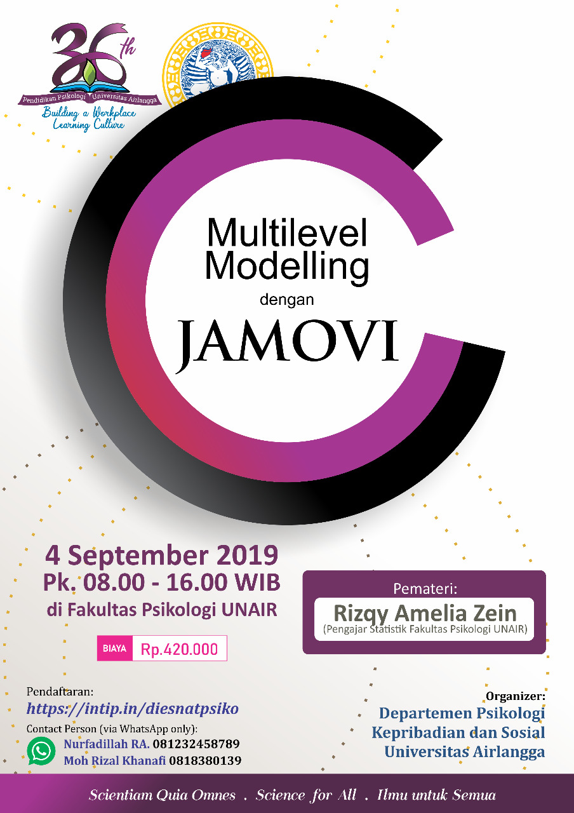

## Deskripsi
Berikut adalah repositori yang digunakan untuk menyimpan semua materi untuk **Workshop Linear Mixed Effect** yang diselenggarakan oleh Departemen Psikologi Kepribadian dan Sosial, Fakultas Psikologi Universitas Airlangga dalam rangka memperingati Dies Natalis Pendidikan Psikologi Universitas Airlangga yang ke-36. 

Materi berlisensi [<i class="fab fa-creative-commons"></i> 4.0](https://creativecommons.org/licenses/by/4.0/). **Materi bebas digunakan kembali namun wajib menyebutkan sumber aslinya**.

## Waktu dan tempat
*Workshop* diselenggarakan pada hari **Rabu, 4 September 2019**, pukul 08.00-16.00 WIB di Ruang Sidang I, Fakultas Psikologi Universitas Airlangga.

## *Outline* materi
Workshop ini akan mencakup pengenalan `lme` dengan sebelumnya membahas konsep dasar mengenai *ordinary least square regression*. Peserta juga akan diminta untuk menganalisis data dengan menggunakan `lme` dan melaporkannya dalam artikel penelitian.

Berikut adalah *outline* materi *workshop*:

### **Bagian 1**
#### Sebelum istirahat (08.00-12.00)

* Berlatih menginspeksi data secara visual dengan *scatterplot*
* Model regresi linier (*ordinary least square*)
* Menarik garis regresi (*fitted regression lines*)
* Varians yang dapat dan yang tidak dapat dijelaskan oleh model (*R^2*)
* Menguji hipotesis
* Mengecek kecocokan model dengan data (*model fit*)
* Mengecek asumsi
  - Distribusi (normalitas) residual
  - Homoskedastisitas
  - Multikolinearitas
* Mendeteksi *outliers*
* Menguji *interaction effects* dan *model change*
* Menulis hasil analisis regresi linier dengan *interaction terms* dalam manuskrip

### **Bagian 2**
#### ## Setelah istirahat (13.00-16.00)

* Struktur data berjenjang/bersarang (*hierarchical/nested data*)
* *Within* dan *between group variance*
* Pengantar *linear mixed-effect* (`lme`)
* *Intra-class correlation* dan *likelihood ratio test* (LRT)
* Membandingkan garis regresi antar kelompok dengan `lme`
* `lme` dengan prediktor level 1 (*random coefficients model*)
  - Mengidentifikasi *intercept* (konstanta) yang berbeda antar kelompok (*random intercept model*)
  - Mengidentifikasi *slopes* (gradien/kemiringan garis) yang berbeda antar kelompok (*random slopes model*)
* *Explained variances* ([Nakagawa & Schielzeth, 2012](https://besjournals.onlinelibrary.wiley.com/doi/full/10.1111/j.2041-210x.2012.00261.x))
  - *Marginal R^2*
  - *Conditional R^2*
* *Contextual effect* dan *partitioning/centering*
* Melaporkan analisis dengan `lme` dalam manuskrip

## Referensi
* Galucci, M. (2019). GAMLj: General analysis for the linear model in jamovi. https://gamlj.github.io/index.html
* Galucci, M. (2019). Mixed models module. https://gamlj.github.io/mixed.html
* Lüdecke, D. (2019). Statistics for mixed effects model. https://strengejacke.github.io/sjstats/articles/mixedmodels-statistics.html
* Nakagawa, S. and Schielzeth, H. (2013), A general and simple method for obtaining R2 from generalized linear mixed‐effects models. Methods Ecol Evol, 4: 133-142. doi: [10.1111/j.2041-210x.2012.00261.x](https://doi.org/10.1111/j.2041-210x.2012.00261.x)
* Peugh, James L. (2010). A practical guide to multilevel modeling. Journal of School Psychology, 48, 85-112. doi: [10.1016/j.jsp.2009.09.002](https://doi.org/10.1016/j.jsp.2009.09.002)

## Contoh penelitian dengan `lme`
* Youngseek, K. & Stanton, J.M. (2016). Institutional and individual factors affecting scientists' data-sharing behaviors: A multilevel analysis: Institutional and Individual Factors Affecting Scientists' Data Sharing Behaviors: A Multilevel Analysis. Journal of the Association for Information Science and Technology, 67(4), 776-799. doi: [10.1002/asi.23424](https://asistdl.onlinelibrary.wiley.com/doi/abs/10.1002/asi.23424)
* Zein, R.A., Putri, N.K., & Ridlo, I.A. (2019). Do Justice and Trust Affect Acceptability of Indonesian Social Health Insurance Policy? A cross-sectional survey of laypeople and health care workers. INA-Rxiv (pre-print). doi: [10.31227/osf.io/fvtjg](https://osf.io/preprints/inarxiv/fvtjg/)

## Sumber belajar lainnya
* [LEMMA (Learning Environment for Multilevel Methods and Applications)](https://www.cmm.bris.ac.uk/lemma/)
* [Learning Statistics with jamovi](https://sites.google.com/brookes.ac.uk/learning-stats-with-jamovi)
* [Video tutorial jamovi dari Datalab](https://datalab.cc/tools/jamovi)

## Sebelum mulai workshop
* Sebaiknya semua peserta sudah memasang jamovi pada perangkatnya masing-masing, untuk menghindari terlalu banyaknya waktu untuk menyelesaikan *troubleshooting* instalasi ketika *workshop*.
* Peserta sangat disarankan untuk menonton [video tutorial jamovi](https://datalab.cc/tools/jamovi) sebelum *workshop* untuk belajar menavigasikan menu dan fitur yang ada dalam jamovi. Cukup hanya dengan menonton yang bagian *Welcome*, *Installing jamovi*, dan *Navigating jamovi* (total durasi kurang lebih hanya 7 menit).

## Cara instalasi *module* GAMLj
Mohon untuk menyimak video petunjuk instalasi *module* GAMLj jamovi berikut ini. Gunakan [jamovi versi terbaru (current) (1.1.2)](https://www.jamovi.org/download.html).

<iframe width="560" height="315" src="https://www.youtube.com/embed/XM9LqoY8w04" frameborder="0" allow="accelerometer; autoplay; encrypted-media; gyroscope; picture-in-picture" allowfullscreen></iframe>

## Video rekaman

### Sesi 1 (08.00-12.00)

<iframe width="560" height="315" src="https://www.youtube.com/embed/WwlILOtniBw" frameborder="0" allow="accelerometer; autoplay; encrypted-media; gyroscope; picture-in-picture" allowfullscreen></iframe>

### Sesi 2 (13.00-16.00)

<iframe width="560" height="315" src="https://www.youtube.com/embed/N2O48MoMddQ" frameborder="0" allow="accelerometer; autoplay; encrypted-media; gyroscope; picture-in-picture" allowfullscreen></iframe>

## Pembaruan dan koreksi

* Dalam video dan salindia yang lama, saya menyebutkan *contextual effects* adalah selisih dari *between-group variances* dengan *within-group variances*. Padahal **yang benar**, *contextual effect* adalah selisih dari **between-group effect** dengan **within-group effect**.
* Saya menambahkan cara menginterpretasi *contextual effect* ketika tandanya negatif, atau positif.

## Poster kegiatan

  

## Jawaban Latihan

### Latihan Mandiri (1): OLS dengan *interaction terms*

[Klik disini untuk melihat jawaban]() saya atas latihan mandiri (1).

### Latihan Mandiri (2): `lme`

[Klik disini untuk melihat jawaban]() saya atas latihan mandiri (1).