## _Outline_

* Berlatih menginspeksi data secara visual dengan _scatterplot_
* Model regresi linier (_ordinary least square_)
* Menarik garis regresi (_fitted regression lines_)
* Varians yang dapat dan yang tidak dapat dijelaskan oleh model (_R_^2^)
* Menguji hipotesis
* Mengecek kecocokan model dengan data (_model fit_)
* Mengecek asumsi
  - Distribusi (normalitas) residual
  - Homoskedastisitas
  - Multikolinearitas
* Mendeteksi _outliers_
* Menguji _interaction effects_ dan _model change_
* Menulis hasil analisis regresi linier dengan _interaction terms_ dalam manuskrip

## Ilustrasi Kasus

::: {.columns}
::: {.column width="70%"}
Marimar adalah seorang wali murid di sebuah PAUD di Kota Surabaya. Pada suatu hari, ia mengamati seorang anak (dan orangtua) yang perilakunya menarik perhatiannya.

Ibu anak tersebut bersikeras untuk menunggui anaknya di sekolah, padahal guru kelas meminta agar Ibu pulang saja, mempercayakan anak pada guru, dengan tujuan melatih kemandirian anaknya.

Melihat ibunya yang menggerutu karena diminta bu Guru pulang, si anak menangis meraung-raung tidak mau ditinggalkan. Akhirnya, terpaksa bu Guru membiarkan si Ibu menunggu di sekolah.

Marimar heran sekaligus penasaran, mengapa tiap anak **memberikan respon yang berbeda** ketika ditinggal orangtuanya di sekolah. Ada yang menangis meraung-raung, ada yang lebih santai dengan langsung bermain. Apakah ada kaitan antara kemandirian anak dengan karakteristik orangtuanya?
:::

::: {.column width="30%"}

:::
:::
<!-- end columns -->

## Eksplorasi dataset

### Dataset 1: dataset-sekolah.omv

* Marimar yang penasaran akhirnya melakukan survei di 5 PAUD di Kota Surabaya, dengan ukuran sampel sebesar total 400 orang
* Buka [laman web _workshop_](https://rameliaz.github.io/mlm-lme-workshop/)
* Klik menu **Dataset** di pojok kanan dan unduh [dataset-sekolah.omv](https://rameliaz.github.io/mlm-lme-workshop/dataset-sekolah.omv)
* Dalam dataset tersebut ada beberapa variabel
  - **neu** = Kecenderungan *Neuroticism* ibu (*five factor model*). Makin tinggi skor, Ibu makin mudah cemas, frustasi, cemburu, rasa bersalah, dan ketakutan berlebihan.
  - **trust** = Kepercayaan ibu bahwa perkembangan anak dapat berlangsung secara natural ([**trust in organismic development**](https://link.springer.com/article/10.1007/s11031-008-9092-2)). Makin tinggi skor, ibu makin percaya.
  - **hi** = Pendapatan seluruh anggota keluarga inti (**household income**). Skor makin tinggi, pendapatan makin banyak.
  - **mandiri** = Tingkat kemandirian anak. Makin tinggi skor, anak makin independen dan lebih santai ketika ditinggal orangtuanya di sekolah.

## Deskriptif

* Coba eksplorasi keempat variabel diatas dengan pendekatan statistik deskriptif.
  - Pada *menu bar*, klik **exploration** lalu **descriptives**. Setelah itu masukkan keempat variabel tersebut dalam kolom **variables**.
  - Klik opsi **Statistics** dan pada bagian **Dispersion** centang **Std. deviation**.
  - Klik opsi **plots**, di bagian **histograms**, centang **histograms** dan **density**.

## _Output_ 

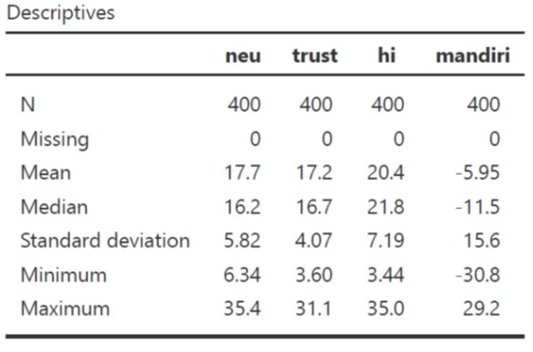 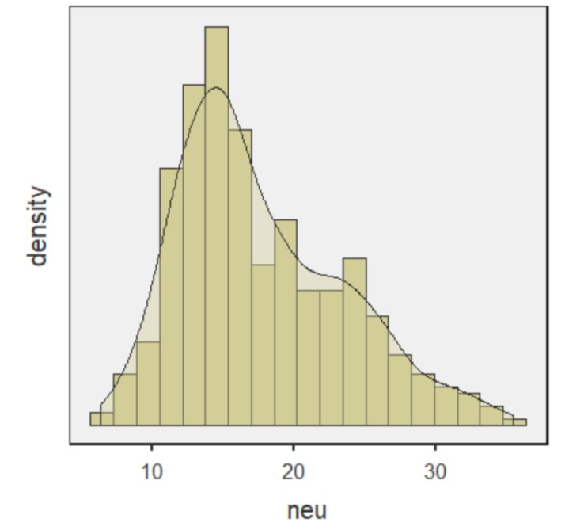

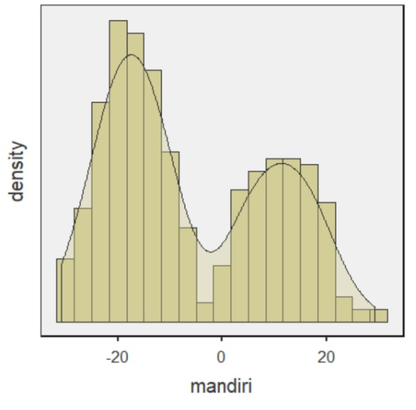 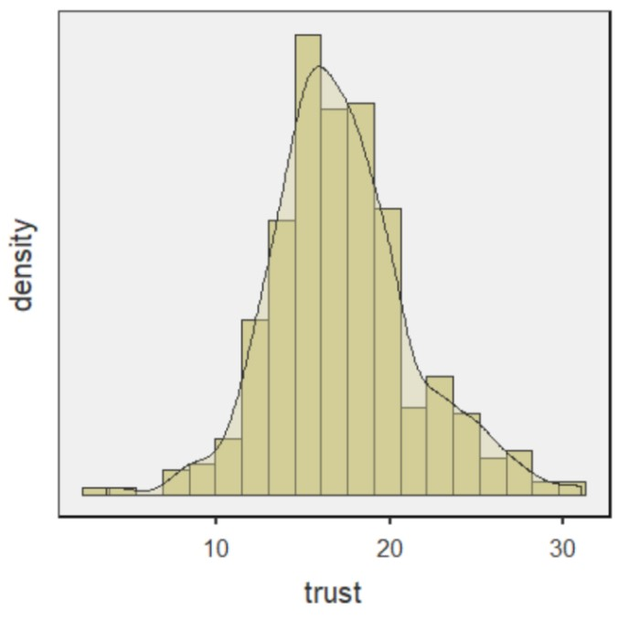 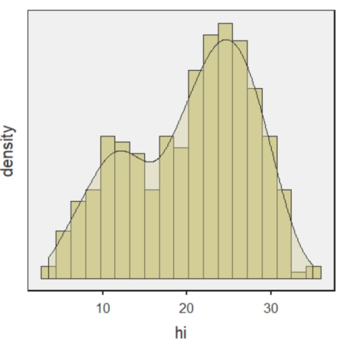

## Membuat *scatterplot*

:::: {.columns}
::: {.column width="60%"}

* Merupakan teknik inspeksi visual kemungkinan terjadinya korelasi antara variabel.
* Setelah melakukan analisis deskriptif, sepertinya akan menarik membandingkan kaitan antara:
  - *Neuroticism* (neu) dengan tingkat kemandirian (mandiri)
  - kepercayaan ibu bahwa anak dapat berkembang secara natural (*trust*) dengan tingkat kemandirian (mandiri)
* Ayo kita buat *scatterplot*nya!
  - Klik **exploration**, pilih **scatterplot**
  - Masukkan **mandiri** pada kolom **Y-axis**
  - Masukkan **neu** (scatterplot 1) dan **trust** (scatterplot 2) pada **kolom X-axis**
  - Pada opsi **regression line**, pilih **linear** dan centang kotak **standard error**

:::
::: {.column width="40%"}

:::
::::

## _Scatterplot_ 

:::: {.columns}
::: {.column width="50%"}

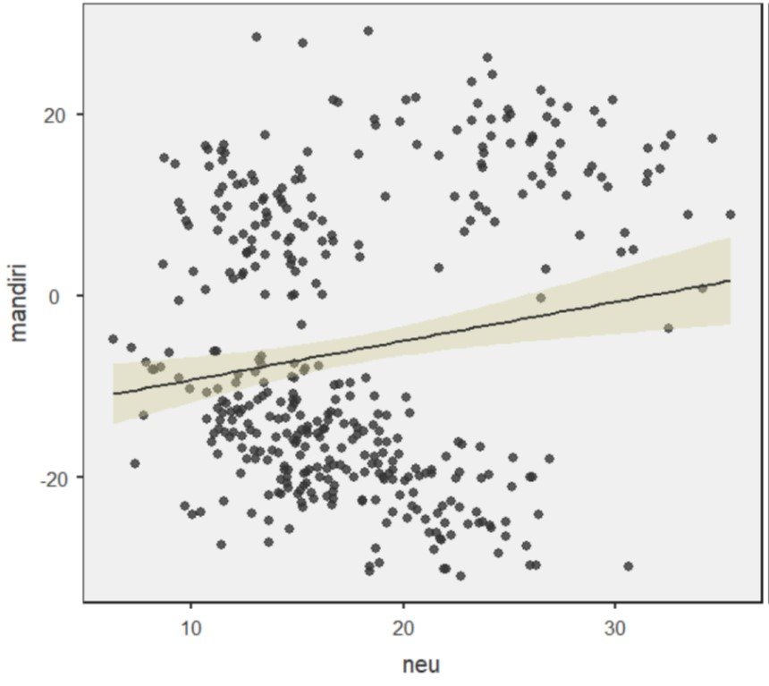

*Scatterplot* 1. *Neuroticism* dan Kemandirian

:::
::: {.column width="50%"}

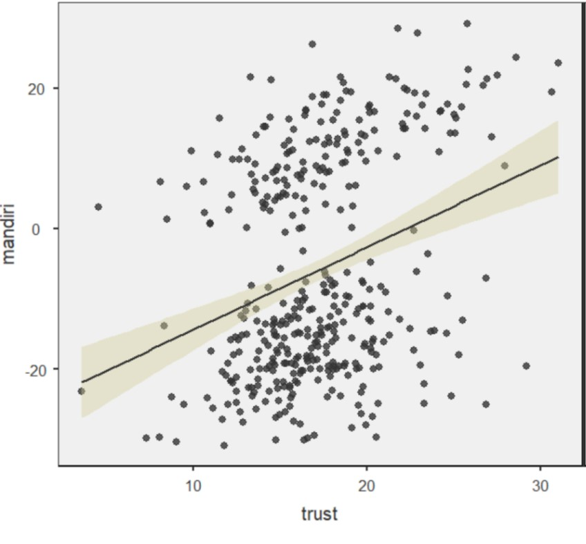

*Scatterplot* 2. *Trust* dan Kemandirian

:::
::::

::: {.footnote}
**Bagaimana kekuatan dan arah hubungan pada _scatterplot_ 1 dan 2?**
:::

## Ayo main!! 📢 {.center}

### 🔗 [**Guess the correlation**](http://guessthecorrelation.com/) 🔗

## Kekuatan dan arah korelasi 1️⃣

Korelasi yang tampak pada _scatterplot_ tadi dapat dikonseptualisasikan dengan lebih jelas dengan menghitung **koefisien korelasi**, yang mengimplikasikan kekuatan hubungan.

* _Pearson's_ r misalnya, biasanya ditulis dengan _r_~xy~, sedangkan _Spearman's_ ρ ditulis _r_~s~.
* Berkisar antara -1 s/d 1
* -1 artinya korelasi negatif sempurna, 1 artinya korelasi positif sempurna
* Koefisien korelasi _Pearson's_ _r_ atau _Spearman's_ ρ dihitung dari kovarians (_covariance_/_average cross product_ dari dua variabel).
  - Dua variabel yang sama sekali tak berkorelasi, maka kovarians nol.

## Kekuatan dan arah korelasi 2️⃣

:::: {.columns}
::: {.column width="55%"}

* Kovarians sulit diinterpretasi, sehingga formula _Pearson's_ r dan _Spearman's_ ρ menstandardisasi kovarians agar lebih mudah diinterpretasi
* Fungsi _Pearson's r_ dan _Spearman's_ ρ mirip _z-score_
* Kuat >< lemahnya koefisien korelasi sebenarnya sangat tergantung konteks penelitiannya.
  - Pada fenomena yang multifaktor, misalnya mencari variabel yang berkaitan dengan kecenderungan Skizofrenia, korelasi 0.3 aja sudah bermakna sangat besar.

:::
::: {.column width="45%"}

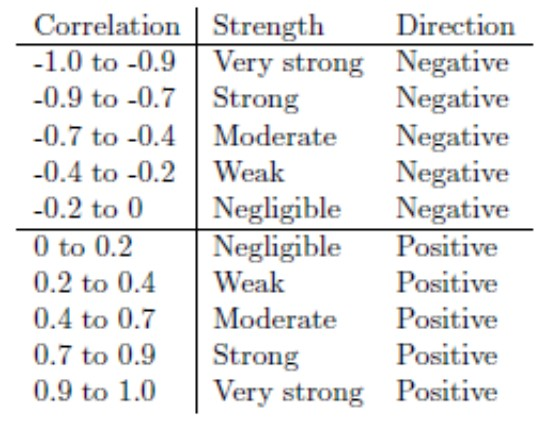

:::
::::

## Regresi linier (_ordinary least square regression_/OLS)

:::: {.columns}
::: {.column width="60%"}

* Merupakan kelanjutan yang lebih kompleks dari _Pearson's_ r
* Ide dasarnya adalah menyusun persamaan garis yang dapat digunakan untuk **memperkirakan** nilai Y ketika nilai X diketahui
  - Contohnya, kita tahu bahwa **kemandirian** berkorelasi positif dan sedang dengan **neuroticism** dan **trust**
  - Namun dengan regresi, kita bisa _mengestimasi_ tingkat kemandirian anak, ketika hanya informasi mengenai _neuroticism_ dan _trust_ yang tersedia.
* OLS bekerja dengan pendekatan _least square_, artinya mencari **jumlah kuadrat terkecil** antara garis regresi (nilai Y yang diperkirakan oleh model) dengan nilai Y yang diobservasi.

:::
::: {.column width="40%"}

:::
::::

## Persamaan garis regresi {.center}

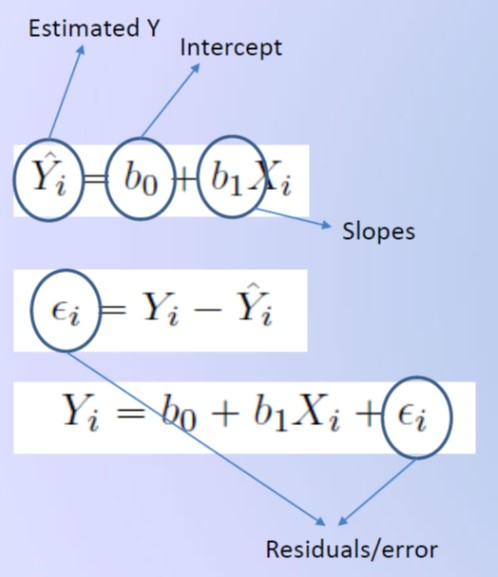

## Contoh garis regresi 

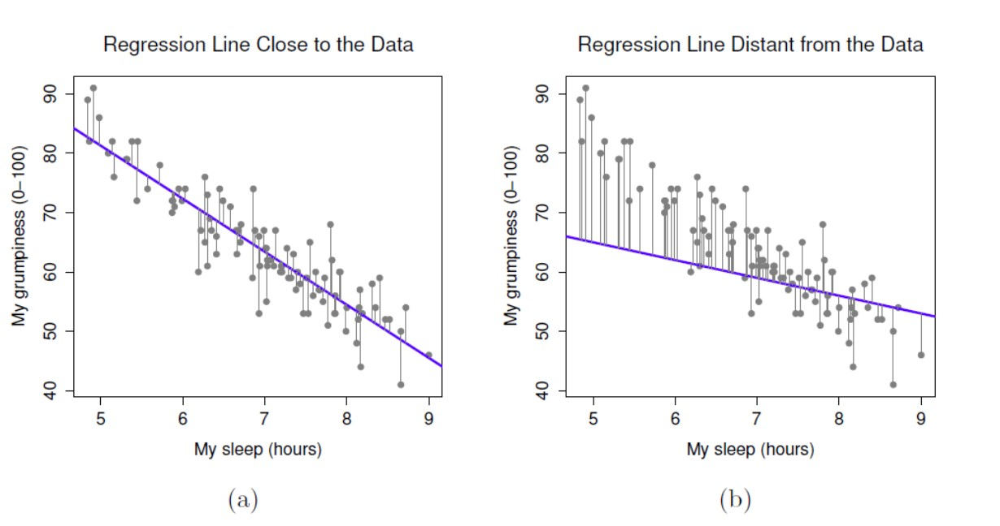

## Asumsi yang harus dipenuhi

* Prediktor dan variabel dependen **berkorelasi secara linier**
  - Lakukan analisis korelasi sebelum melakukan regresi untuk memastikan asumsi ini terpenuhi
* Residual (varians _error_) variabel dependen yang tidak dapat dijelaskan oleh model
  - Berdistribusi normal
  - Variansnya homogen (**homoskedasdisitas**)
  - Tidak dipengaruhi oleh prediktor lain diluar model
* Prediktor dalam model independen satu sama lain (tidak berkorelasi)
  - Berlaku ketika ada dua atau lebih prediktor dalam satu model regresi
  - Kalau prediktor berkorelasi satu sama lain maka telah terjadi **multi-kolinearitas**
* **Data/observasi dan residual harus independen**

## Latihan 1️⃣

Marimar ingin tahu apakah ada kaitan antara kecenderungan _neuroticism_ ibu terhadap kemandirian anak.

* Klik menu **regression**, pilih **linear regression**.
* Masukkan **mandiri** dalam kolom **dependent variable** dan **neu** pada **covariates**.
* Pada opsi **assumption checks**, centang **Q-Q plot of residuals**, **residual plots** dan **Cook's distance**.
* Pada opsi **model fit**, centang **R**, **R^2^**, dan **F test**.
* Pada opsi **model coefficients**, centang **ANOVA test**, **confidence interval**, dan **standardized estimates**.

## Model fit

:::: {.columns}
::: {.column width="55%"}

* Model regresi kita cukup mampu menggambarkan data (*F*(1,398)=10.5, p=.001).
* Namun model hanya mampu menjelaskan 2.58% varians kemandirian anak (R^2^=.0258).
* Coba bandingkan *sum of squares* antara **neu** dengan **Residuals** (tabel ANOVA).
  - Manakah yang lebih banyak; varians yang **dapat**, atau yang **tidak dapat dijelaskan** oleh model?

:::
::: {.column width="45%"}

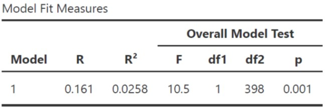

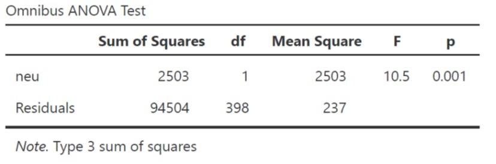

:::
::::

::: {.callout-note}
**Statistical grand prize ❗: menjelaskan varians variabel dependen**

Hampir semua teknik statistik intinya adalah membandingkan varians yang dapat dengan yang tidak dapat dijelaskan (residual) oleh model
:::

## Koefisien model

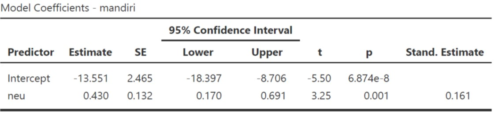

#### Kecenderungan *neuroticism* ibu dapat menjelaskan variasi kemandirian anak (*B*=0.430 95% CI [0.170, 0.691], *SE*=0.132, *t*=3.25, *p*=.001).

#### Interpretasi *standardized* (*β*) dan *unstandardized* (*B*) *estimates*

* *Unstandardized* (*B*) *estimates*: Setiap perubahan *neuroticism* sebesar 1 poin, maka tingkat kemandirian juga berubah sebesar 0.43 poin.
* *Standardized* (*β*) *estimates*: Setiap berubah *neuroticism* sebesar 1SD, maka tingkat kemandirian juga berubah sebesar 0.161SD.

::: {.callout-tip}
**Tips ❗**: Selalu laporkan *unstandardized estimates* dan *confidence interval*nya ([Appelbaum, et. al., 2018](http://dx.doi.org/10.1037/amp0000191)).
:::

## Diagnostik model: distribusi residual

:::: {.columns}
::: {.column width="55%"}

* Salah satu asumsi penting yang harus dipenuhi ketika melakukan regresi OLS adalah **residual (bukan data)** harus berdistribusi normal.
* Sebaran residual mengikuti garis diagonal dalam Q-Q Plot, tandanya residual berdistribusi normal.
* Apabila residual tersebar secara acak atau makin menjauhi garis diagonal, berarti tidak berdistribusi normal dan ini melanggar asumsi *ordinary least square*.
* Akibatnya, model tak dapat diinterpretasi dan koefisien model (*intercept* dan *slope*) bias.

:::
::: {.column width="45%"}

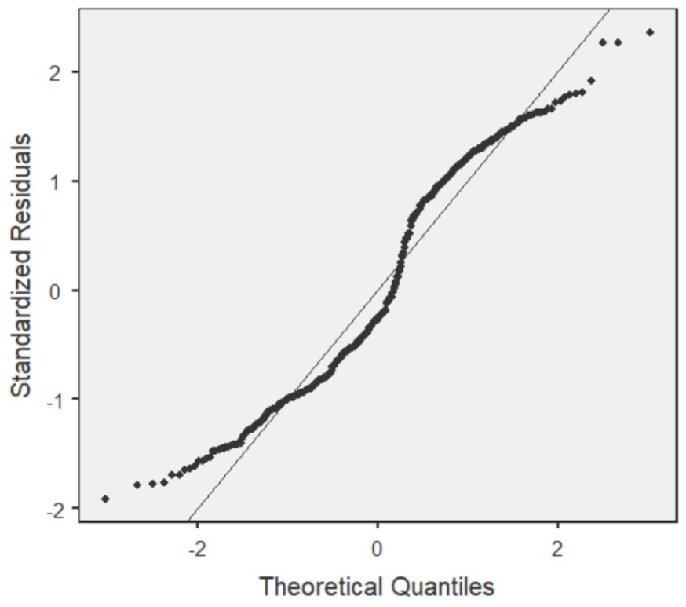

:::
::::

## Diagnostik model: varians residual 1️⃣

:::: {.columns}
::: {.column width="55%"}

* Asumsi lain yang harus dipenuhi adalah **homoskedasdisitas**.
* Residual memenuhi asumsi homoskedasdisitas, apabila variansnya **uniform (sama)** meskipun nilai X dan *fitted* Y (nilai Y yang diestimasi oleh model) berubah-ubah.
  - Hal ini ditunjukkan dari dua grafik disamping yang menunjukkan distribusi **varians residual uniformed**.
* Apabila asumsi ini dilanggar, maka residual mengalami **heteroskedasdisitas**, dengan begitu, estimasi model akan bias.
* Kalau residual menunjukkan karakteristik heterokedastik, maka distribusi residual akan terlihat seperti kerucut.

:::
::: {.column width="45%"}

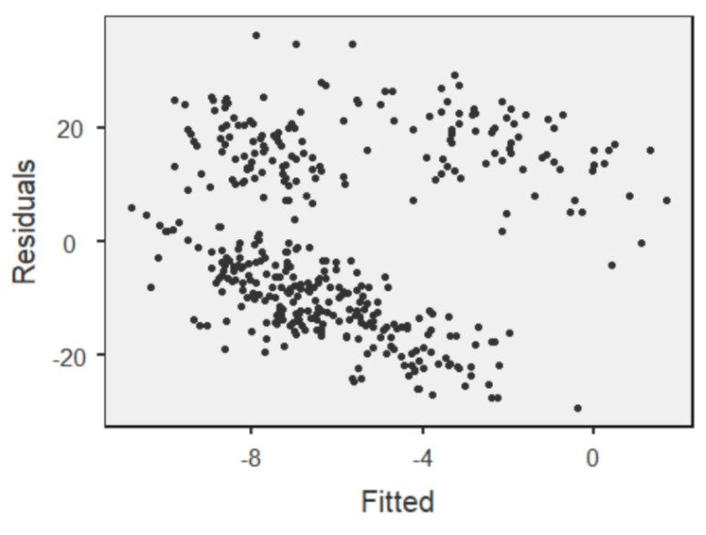

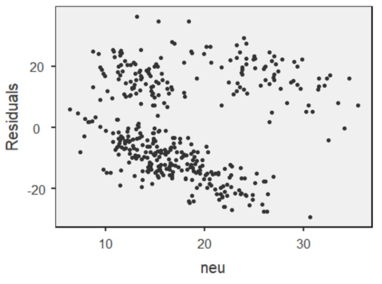

:::
::::

## Diagnostik model: varians residual 2️⃣

:::: {.columns}
::: {.column width="55%"}

* Plot disamping kanan menunjukkan kondisi **heteroskedastik**
* Contoh heteroskedasdisitas: pendapatan personal dan usia
  - Pada usia **anak-anak, remaja dan dewasa awal**, variasi tingkat pendapatan sangat kecil, sedangkan yang **usianya lebih tua**, variasi tingkat pendapatan **lebih besar**.
  - Apa kira-kira alasannya?

:::
::: {.column width="45%"}

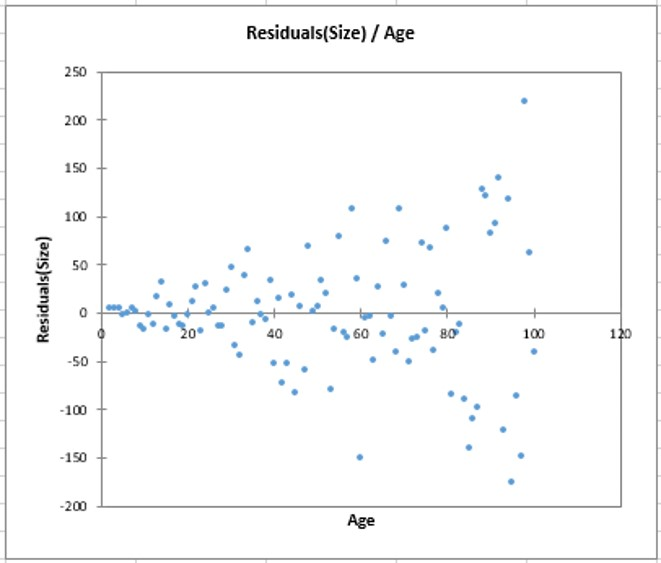

:::
::::

## Diagnostik model: deteksi _outliers_ 1️⃣

:::: {.columns}
::: {.column width="55%"}

* Gerak-gerik data _outlier_ penting untuk diperhatikan.
  - Seperti grafik di sebelah kanan, penambahan data _outlier_ dapat merubah garis regresi secara drastis.
* Untuk melihat seberapa 'mengkhawatirkan' data _outlier_ ini dalam mengganggu garis regresi, kita dapat menggunakan _Cook's distance_.
* Umumnya, apabila _outlier_ dibuang dan perubahan rata-rata, median, dan standar deviasi kurang dari 1, dapat diabaikan. Artinya _outlier_ tersebut tidak terlalu mengganggu garis regresi.

:::
::: {.column width="45%"}

:::
::::

## Diagnostik model: deteksi _outliers_ 2️⃣ 

:::: {.columns}
::: {.column width="60%"}

* Kalau diatas 1 bagaimana?
  - Coba buat lagi garis regresi tanpa _outlier_ tersebut, cari tahu kenapa nilainya bisa se-ekstrim itu
  - _Outlier_ umumnya tidak boleh dihapus dari dataset tanpa justifikasi yang jelas, karena ini termasuk [_questionable research practices_](https://pmc.ncbi.nlm.nih.gov/articles/PMC4114807/).
  - Kalau sangat mendesak, _outlier_ dapat dikeluarkan dari model. Tetapi ini tidak disarankan dan kalaupun dilakukan, analisis **harus dilaporkan dua versi; dengan dan tanpa _outlier_.**
  - Daripada dihapus, sebaiknya pakai regresi dengan [_robust estimator_](https://forum.jamovi.org/viewtopic.php?t=4067) yang dapat mengurangi efek _outlier_.
* Dari _output_ di samping, dapat disimpulkan bahwa apabila _outlier_ tidak disertakan dalam analisis, maka perubahan rerata, median, dan standar deviasi keseluruhan sampel kurang dari 1 dari nilai asalnya.

:::
::: {.column width="40%"}

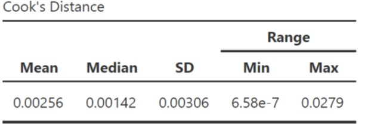

:::
::::

## Cara melaporkannya dalam manuskrip

"... untuk menguji hipotesis penelitian, peneliti melakukan analisis regresi *ordinary least square* (OLS). Hasil analisis menunjukkan bahwa model cocok menggambarkan data, namun hanya mampu menjelaskan kurang dari 3% varians tingkat kemandirian siswa (*F*(1,398)=10.5, p=.001, R^2^=.0258).

Kecenderungan *neuroticism* ibu berkontribusi berarti dalam menjelaskan varians tingkat kemandirian siswa, dimana perubahan kecenderungan *neuroticism* sebesar 1 poin diasosiasikan dengan perubahan tingkat kemandirian anak sebesar 0.43 (*B*=0.430 95% CI [0.170, 0.691], *SE*=0.132, *t*=3.25, *p*=001).

Setelah dilakukan diagnostik, varians yang tidak dapat dijelaskan oleh model berdistribusi normal dan ketika dikorelasikan dengan nilai prediktif tingkat kemandirian siswa dan kecenderungan *neuroticism* ibu, maka menghasilkan varians yang homogen (homoskedastik).

Diagnostik *outlier* dilakukan dengan menggunakan *Cook's distance*, dan menghasilkan kesimpulan bahwa apabila *outlier* tidak disertakan dalam model, maka perubahan rerata, nilai tengah, dan simpangan baku kurang dari satu dari nilai awalnya, sehingga tidak berpotensi mendistorsi garis regresi..."

## Latihan 2️⃣ 

* Marimar ingin menambahkan interaksi antara _neuroticism_ dengan _trust_
  - Mungkin saja ibu yang percaya/kurang percaya bahwa anak dapat berkembang secara natural, korelasi antara *neuroticism* dengan kemandirian akan makin negatif.
  - Selain itu, bisa jadi ada kaitannya antara pendapatan keluarga dengan tingkat kemandirian anak.
* Tambahkan variabel **trust**, **neu**, dan **hi** dalam kolom **covariates**.

## Latihan 2️⃣ 

* Lakukan semua langkah yang sudah dilakukan di Latihan 1️⃣
* Pada opsi **model builder**, klik **add new block**
  - Klik **Block 1**, sampai keluar *shading* di pinggir kotak, lalu masukkan **hi**
  - Klik **Block 2**, sampai keluar *shading* di pinggir kotak
  - Kemudian sambil menekan tombol `ctrl`, klik **neu** kemudian **trust**, lalu klik tanda panah yang kedua dan pilih **interaction**
* Dengan begitu kita punya 2 model regresi
  - Model 1 prediktornya **hi**
  - Model 2 prediktornya **hi** dan interaksi antara **neu** dengan **trust**
* Pada opsi **assumption checks**, tambahkan centang pada **collinearity statistics**
* Pada opsi **model fit**, klik **AIC** dan **BIC**.
* Pada opsi **estimated marginal means**, masukkan **neu** dan **trust** dalam **terms 1**

## Model fit

:::: {.columns}
::: {.column width="55%"}

Model 2 (*F*(2,397)=58.2, p\<.001, R^2^=.226) dapat menjelaskan varians tingkat kemandirian anak lebih baik daripada Model 1 (*F*(1,398)=10.2, p=.002, R^2^=.025), dengan *overlapping variances* sebesar 22.6% dibanding 2.5%.

**_Information criteria_ (AIC & BIC)**

* Digunakan untuk mengakomodasi kelemahan dari _R_^2^ (apabila prediktor dalam model ditambah terus, maka nilai _R_^2^ akan terus naik)
* Kelemahan _R_^2^ ini serupa dengan prinsip reliabilitas dan jumlah aitem
* Rumus dari _information criteria_ memberi "penalti" kepada model yang mengandung lebih banyak variabel prediktor
* Pilih model dengan AIC dan BIC yang terkecil (Model 2)

:::
::: {.column width="45%"}

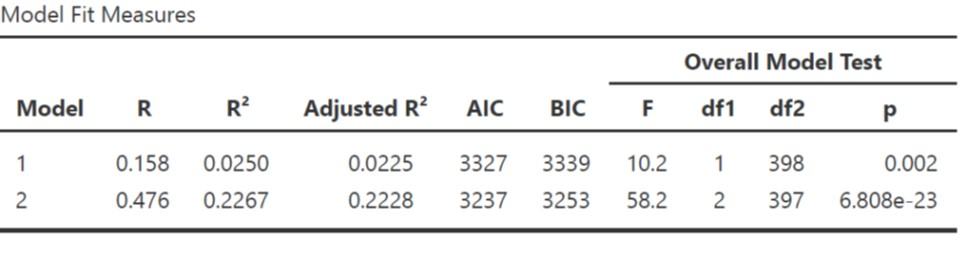

:::
::::

## _Model comparison_

:::: {.columns}
::: {.column width="55%"}

Ketika dibandingkan, Model 1 dan Model 2 berbeda signifikan (*F*(1,397)=104, _p_\<.001). Δ_R_^2^=.202, artinya selisih _R_^2^ Model 1 dan Model 2=.202 atau _R_^2^ naik sebesar 20.2%

**Coba perhatikan Residuals Model 1 dengan Model 2**

:::
::: {.column width="45%"}

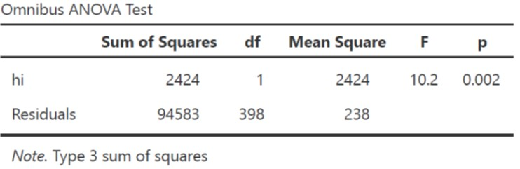

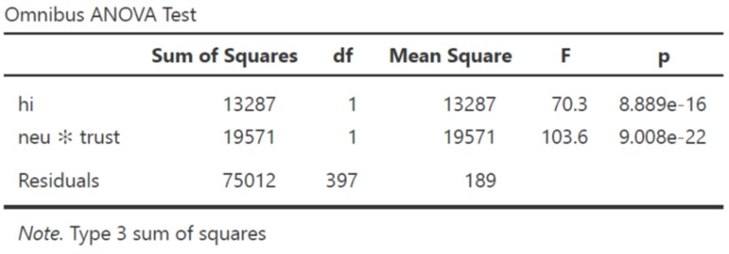

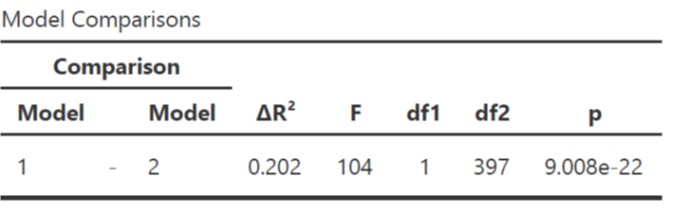

:::
::::

## Koefisien model 2

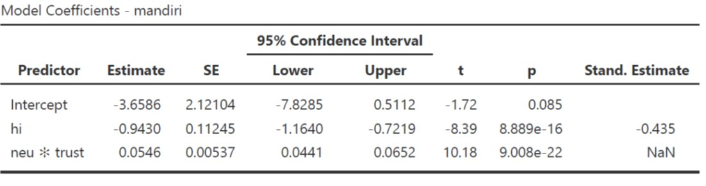

#### Pendapatan keluarga dapat menjelaskan variasi kemandirian anak (*B*=-0.943 95% CI [-1.164, -0.721], *SE*=0.112, *t*=-8.39, *p*\<.001).

#### *Interaction terms* juga signifikan dalam menjelaskan varians kemandirian anak (*B*=0.054 95% CI [0.044, 0.065], *SE*=0.005, *t*=10.18, *p*\<.001).

---

## *Simple slope*

:::: {.columns}
::: {.column width="55%"}

* Interpretasi *slopes* pada *interaction terms*:
  - *Unstandardized B* yang positif artinya, pada ibu dengan *trust* yang tinggi, korelasi antara kecenderungan *neuroticism* dengan kemandirian anak juga semakin positif/menguat.

:::
::: {.column width="45%"}

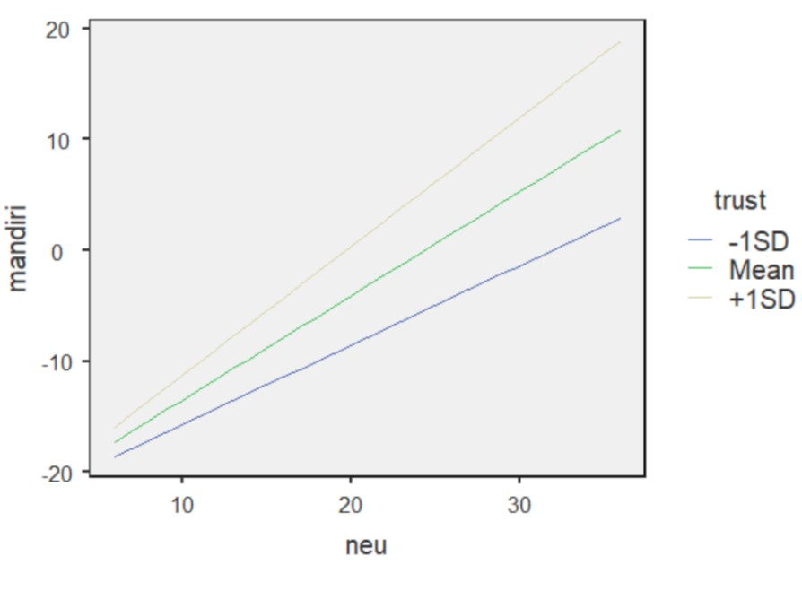

:::
::::

## Diagnostik kolinieritas

:::: {.columns}
::: {.column width="55%"}

* Dapat dideteksi dengan melakukan analisis melihat *variance inflated factors* (VIF).
  - Bila VIF \< 2.5, maka multi-kolinearitas kemungkinan besar tidak terjadi.
* Penelitian *longitudinal* punya potensi terjadinya autokorelasi (residual *time 1* dan *time 2* berkorelasi)
  - Dapat dicek dengan tes Durbin-Watson
  - Bila nilai p analisis autokorelasi \> 0.001, maka multi-kolinearitas tidak terjadi.

:::
::: {.column width="45%"}

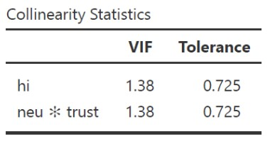

:::
::::

## Bagaimana melaporkannya?

"...untuk menginvestigasi keterkaitan antara pendapatan keluarga, kecenderungan *neuroticism* ibu, dan kepercayaan ibu bahwa perkembangan anak dapat terjadi secara natural dengan tingkat kemandirian anak, peneliti melakukan analisis regresi linier hirarkial dengan *interaction terms*. Peneliti menyusun dua model, dimana; model 1 mengestimasi varians tingkat kemandirian anak dengan pendapatan keluarga inti sebagai prediktor, sedangkan pada model 2 peneliti menambahkan prediktor berupa *interaction terms* antara *neuroticism* dengan *trust*.

Ketika dibandingkan, Model 1 dan Model 2 berbeda signifikan (*F*(1,397)=104, p\<.001). R^2^ bertambah sebesar 20.2% (ΔR^2^=.202). Model 2 (*F*(2,397)=58.2, p\<.001, R^2^=.226, AIC=3237, BIC=3253) dapat menjelaskan varians tingkat kemandirian anak lebih baik daripada Model 1 (*F*(1,398)=10.2, p=.002, R^2^=.025, AIC=3327, BIC=3339).

Pendapatan keluarga dapat menjelaskan variasi kemandirian anak (*B*=-0.943 95% CI [-1.164, -0.721], *SE*=0.112, *t*=-8.39, *p*\<.001). Interaksi antara *neuroticism* dengan *trust* juga signifikan (*B*=0.054 95% CI [0.044, 0.065], *SE*=0.005, *t*=10.18, *p*\<.001). Artinya, korelasi antara kecenderungan *neuroticism* ibu dengan kemandirian anak akan menguat pada ibu yang *trust*nya tinggi.

Potensi multikolinieritas dideteksi dengan VIF dan hasil analisis menunjukkan multikolinieritas kemungkinan besar tidak terjadi (VIF=1.38)..."

## Latihan mandiri 1️⃣

:::: {.columns}
::: {.column width="70%"}
Fernando Jose sebal sekali karena ia kembali kehilangan pengokotnya dan ini kali ketiga ia kehilangan pengokot yang baru dibelinya seminggu yang lalu.

Teman-teman kerjanya memang punya kebiasaan buruk meminjam barang tanpa seijinnya. Ia akhirnya bertanya, apa ya yang menyebabkan teman-temannya berperilaku seperti itu?

Akhirnya ia menduga, mungkin ada kaitannya dengan faktor kepribadian (*conscientiousness*) dan faktor situasional di tempat kerjanya.

Untuk faktor situasi, ia mengamati sepertinya persepsi atas kondisi kerja yang informal dan relasi formal antara senior-junior mungkin juga berkaitan dengan timbulnya perilaku tersebut.
:::

::: {.column width="30%"}

:::
::::
<!-- end columns -->

## Eksplorasi dataset 2️⃣

### Dataset 2: dataset-organisasi.omv

* Fernando Jose akhirnya melakukan penelitian survei pada 450 karyawan di 3 perusahaan yang berbeda
* Buka [laman web _workshop_](https://rameliaz.github.io/mlm-lme-workshop/) dan unduh [dataset-organisasi.omv](https://rameliaz.github.io/mlm-lme-workshop/dataset-organisasi.omv)
* Dalam dataset tersebut ada beberapa variabel
  - **con** = Kecenderungan *conscientiousness* karyawan. Makin tinggi skornya, karyawan lebih mungkin menunjukkan kehati-hatian dan keteraturan dalam bekerja, efisien, dan bertanggung jawab.
  - **inf** = Persepsi atas nuansa informal dalam kantor. Makin tinggi, karyawan makin merasa situasi kantor lebih informal.
  - **pow** = Jarak kuasa (*power distance*) dalam relasi antar-karyawan. Makin tinggi, budaya senioritas makin parah.
  - **incivil** = Intensitas perilaku tidak beradab. Makin besar skornya, karyawan akan lebih mungkin *emotionally abusive*, suka mengambil barang teman tanpa ijin, dan perilaku tidak pantas yang lain.

## Latihan mandiri 1️⃣

* Buatlah 2 model untuk mengestimasi varians perilaku tidak beradab dimana:
  - Prediktor model 1: jarak kuasa
  - Prediktor model 2: interaksi antara *conscientiousness* dengan persepsi situasi kerja yang informal
* Bagaimana hipotesisnya?
* Laporkan hasil analisis datanya dan berikan penjelasan singkat apakah hasil analisis data menolak/gagal menolak hipotesis penelitian.

## Ada pertanyaan❓

{fig-align="center"}

::: {.callout-note}
* Paparan disusun dengan menggunakan <i class="fa-brands fa-r-project"></i> dan [**Quarto**](https://quarto.org) dengan *template* dari [UNAIR Theme](https://github.com/rameliaz/quarto-unair-theme).
* Kontak saya via <i class="fas fa-paper-plane"></i> <a href="mailto:amelia.zein@psikologi.unair.ac.id">amelia.zein@psikologi.unair.ac.id</a>
:::