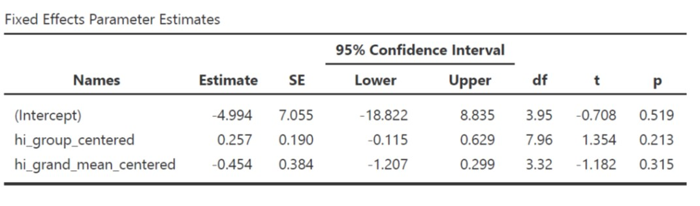

class: inverse, middle, title-slide, spaced

```{r setup, include=FALSE}
library(fontawesome)
library(tidyverse)
library(emo)
options(htmltools.dir.version = FALSE, width=120)
```

class: title-slide, spaced

   

# Linear Mixed Effect (Multi-Level Modeling)
## Menggunakan `jamovi` (GAMLj): Bagian 2
<br>
### <b>Rizqy Amelia Zein</b>
* Dosen, [Fakultas Psikologi, Universitas Airlangga](https://psikologi.unair.ac.id)
* Anggota, [#SainsTerbuka Airlangga](https://sainsterbukaua.github.io/) `r fa("universal-access")`
* Relawan, [INA-Rxiv](https://inarxiv.id) 
* Researcher-in-training, [Institute for Globally Distributed Open Research and Education (IGDORE)](https://igdore.org/)

---

class: inverse, middle, center

# Quiz time! `r emo::ji("smile")`
## [Klik disini untuk menuju laman kuis.](https://menti.com)


---

# Coba kita lihat lebih dekat...

* Coba kita lakukan inspeksi visual sekali lagi dataset-sekolah.omv

* Buat *scatterplot* dimana **mandiri** menjadi **Y-Axis**, sedangkan **neu**, **hi**, **trust** sebagai **X-Axis**

* Kemudian masukkan **idsekolah** pada kolom **Group**
  - Fungsinya, kita akan mendapatkan garis regresi untuk masing-masing sekolah

* Apa yang terjadi?

---

class: center, middle

  <br>

</br>


---

# Ternyata *covariance*nya bervariasi di tiap kelompok! `r emo::ji("scream")`

.pull-left[
* *Intercept* *neuroticism* dan *trust* ternyata bervariasi di setiap sekolah

* Yang menarik, tidak hanya *intercept*, *slope* pendapatan personal juga bervariasi di setiap sekolah
  - Berdasarkan analisis yang kita lakukan pagi tadi, disimpulkan bahwa **pendapatan keluarga dan kemandirian anak korelasinya negatif** 
  - Tapi bisakah **kesimpulan yang sama** kita tarik untuk Sekolah B dan D?

* Hati-hati *ecological fallacy*!
  - Terjadi ketika kita salah menyimpulkan suatu gejala yang skalanya individual, padahal yang dianalisis oleh peneliti sesusungguhnya fenomena yang berlaku pada skala yang lebih besar (kelompok atau sub-kelompok)
]

.pull-right[


]

---

class: middle, center, inverse

# Struktur sampel bersarang/berjenjang


---

# Apa yang harus dilakukan?

--

* Pura-pura *ga tahu*, kita abaikan saja dan langsung menggunakan regresi OLS, dengan atau tanpa informasi mengenai pengelompokan data sebagai variabel kontrol.

--

  - Masalahnya, data/observasi kita sangat bergantung pada pengelompokan unit analisis
  - **Nah, lalu melanggar asumsi OLS dong?** (data/observasi dan residual harus independen)
  - Efeknya, *standard error* yang diestimasi oleh model terlalu kecil (karena mengabaikan varians dependen variabel yang ditentukan oleh kelompok)
  - Varians variabel dependen yang tidak bisa dijelaskan (residual) akan makin besar
  - Kesimpulan/inferensi yang ditarik menjadi tidak tepat, sehingga risiko terjadinya *type I error* meningkat.

--

* Gimana kalau pengelompokan (*group status*) dimasukkan aja dalam regresi OLS sebagai variabel moderator
  - Dengan begitu, estimasi *standard error* disesuaikan dengan menggunakan *marginal model*

--

  - Estimasi *standard error* akan lebih presisi, **tetapi** kita tetap tidak bisa mengestimasi *between-group variance*
  
--

* Kalo di agregat? Jadi unit analisis yang tadinya individual, menjadi kelompok.

--

  - Ukuran sampel menjadi lebih sedikit, sehingga *statistical power* menjadi lebih rendah`r emo::ji("exclamation_mark")`


---

class: center, middle

# *Fixed* dan *random effects*

.pull-left[

## Model *fixed effects*


]

.pull-right[

## Model *random effects*


]

---

class: inverse, middle, center

# *Full model*


---

# Kovarians (korelasi) antara *random intercept* dan *random slopes* (σ<sub>*U0*</sub><sub>*U1*</sub>)

.pull-left[

* **Nilainya positif**, maka semakin tinggi *intercept* akan diasosiasikan dengan kemiringan garis yang lebih curam/*slopes* yang lebih besar

* Misalnya, di sekolah yang **rata-rata pendapatan** keluarga inti perbulan siswanya **tinggi**, maka **korelasi** antara pendapatan per bulan dengan tingkat kemandirian siswa **akan menguat**.

* **Nilainya negatif**, maka semakin tinggi *intercept* akan diasosiasikan dengan kemiringan garis yang lebih landai/*slopes* yang lebih kecil

* Misalnya, di sekolah yang **rata-rata pendapatan** keluarga inti perbulan siswanya **tinggi**, maka **korelasi** antara pendapatan per bulan dengan tingkat kemandirian siswa **akan melemah**.
]
  
.pull-right[


]


---

# Parameter yang diestimasi dalam *linear mixed effects*

* *Fixed intercept* (*c*<sub>*00*</sub>)

* *Fixed slopes* (*c*<sub>*10*</sub>)

* Varians *random intercept* (σ<sup>2</sup><sub>*U0*</sub>)

* Varians *random slopes*  (σ<sup>2</sup><sub>*U1*</sub>)

* Kovarians (korelasi) antara *random intercept* dan *random slopes* (σ<sub>*U0*</sub><sub>*U1*</sub>)

* Varians residual level-1 (σ<sup>2</sup><sub>*e*</sub>)

---

class: center, inverse, middle

# Yuk kita coba! `r emo::ji("fist")`
## Pastikan *module* GAMLj sudah terpasang di jamovi


---

# Latihan (3): Kembali ke sekolah `r emo::ji("school")`

Setelah menginspeksi data secara visual, kita tahu bahwa korelasi antara **pendapatan keluarga** dengan **tingkat kemandirian anak** adalah yang paling bervariasi (daripada prediktor yang lainnya). Oleh karena itu, kita akan membuat *linear mixed model* dengan **pendapatan keluarga** sebagai prediktor, dan **tingkat kemandirian anak** sebagai variabel dependen.

## Bikin "model kosong"

* Yaitu model yang isinya hanya *intercept* saja, tidak ada prediktornya (*slopes*)

* Pada *menu bar*, klik **Linear Models**, pilih **mixed models**
  - Masukkan **mandiri** dalam kolom **dependent variable**
  - Masukkan **idsekolah** dalam kolom **cluster variables**
  - Pada menu **random effects** masukkan **intercept|idsekolah** dalam kolom **random coefficients**
  
* Catat nilai AIC yang tersedia dalam tabel **model info**

* Yuk ingat-ingat lagi, AIC fungsinya untuk apa ya? `r emo::ji("confused")`

---

# Latihan (3)

## Bikin model dengan prediktor (*linear mixed model*)

* Masukkan **hi** dalam kolom **covariates**

* Pada menu **random effects**, masukkan juga **hi|idsekolah**, karena kita akan mengestimasi **random slopes**nya juga
  - Centang opsi **LRT for Random Test**

* Pada menu **covariates scaling**, ubah **centered** menjadi **cluster-based centered**
  - Berkaitan dengan **partitioning** (akan dijelaskan di bagian selanjutnya)

---

# *Fixed coefficients*

.pull-left[

* Tes kecocokan model (*Omnibus Test*) tidak signifikan (*F*(1,3.98)=0.309, p=.608) 
  - Berbeda sekali dengan hasil OLS
  - **Kemungkinan besar** korelasi antara pendapatan keluarga per bulan dengan kemandirian **tidak linier**

* Kita tidak punya cukup bukti untuk menolak hipotesis nol, bahwa pendapatan keluarga per bulan dengan kemandirian tidak berkaitan (*B*=-0.207 95% CI [-0.937, 0.523], *SE*=0.372, *t*=-0.556, *p*=.608).
  - Sekali lagi, berbeda sekali dengan hasil OLS

]

.pull-right[


]

---

# *Random coefficients*

.pull-left[

* Varians kemandirian paling banyak dijelaskan oleh rata-rata tingkat kemandirian anak di masing-masing sekolah (varians *random intercept* (σ<sup>2</sup><sub>*U0*</sub>)) daripada oleh varians *random slopes*  (σ<sup>2</sup><sub>*U1*</sub>).

]

.pull-right[

 <br>
 </br>

]

---

# *Random coefficients*

.pull-left[

* Menguji efek sekolah (kelompok)
  - *Intra-class correlation*, yaitu merupakan proporsi total varians variabel dependen yang dapat dijelaskan oleh variasi antar kelompok
  
  - *Likelihood ratio test* (LRT), yaitu teknik untuk menguji ada/tidaknya perbedaan varians antar-kelompok
  
  - Keduanya juga bisa berfungsi sebagai indikator perlu/tidaknya `lme` dilakukan
  
]

.pull-right[

 <br>
 </br>

]

---

# *Random coefficients*

.pull-left[

* Menguji efek sekolah (kelompok) / (*testing group effects*)

  - ICC=0.931, artinya 93.1% varians tingkat kemandirian anak dijelaskan oleh perbedaan kelompok. ICC diatas 0.1 biasanya menunjukkan `lme` adalah opsi yang lebih baik daripada OLS.
  
  - LRT juga menunjukkan bahwa kita dapat menolak hipotesis bahwa tidak adanya perbedaan varians tingkat kemandirian antar-kelompok (LRT(2)=74.0, *p*<.001).
]

.pull-right[

 <br>
 </br>

]

---


# *Model Comparison*

.pull-left[

* AIC
  - Apabila kita membandingkan "model kosong" dengan model yang ada prediktor, maka model yang terakhir lebih mampu menjelaskan varians kemandirian anak.

* R<sup>2</sup> ([Nakagawa & Schielzeth, 2012](https://besjournals.onlinelibrary.wiley.com/doi/full/10.1111/j.2041-210x.2012.00261.x))
  
  - *Marginal*, merupakan proporsi varians variabel dependen yang dapat dijelaskan oleh **hanya fixed models** saja
  
  - *Conditional*, merupakan proporsi varians variabel dependen yang dapat dijelaskan oleh **fixed** dan **random models** sekaligus
  
  - Varians tingkat kemandirian anak yang dapat dijelaskan oleh *fixed model* saja hanya 0.12%, sedangkan yang dapat dijelaskan oleh keseluruhan model adalah 93.18%.

]

.pull-right[

 <br>
 <br>
 <br>
 </br></br></br></br>

]

---

# *Contextual effects* & *partitioning*

* *Within-group effect*
  - Seberapa besar selisih Y dari 2 orang yang berada di **kelompok yang sama**, ketika **selisih Xnya** sebesar 1 poin?
  - Seberapa besar perbedaan tingkat kemandirian dua orang anak yang berada dalam **sekolah yang sama**, ketika selisih **tingkat pendapatan keluarga** mereka berbeda sebesar 1 poin?

* *Between-group effect*
  - Seberapa besar selisih Y dari 2 orang yang berbeda (dari 2 kelompok yang berbeda), namun berada dalam **posisi relatif yang sama** (dibandingkan dengan rerata kelompok), ketika **selisih X** mereka sebesar 1 poin?
  - Seberapa besar perbedaan tingkat kemandirian 2 orang anak yang berasal dari **sekolah yang berbeda**, namun pada **posisi yang sama** apabila **dibandingkan dengan rata-rata** kemandirian anak-anak di **sekolah mereka masing-masing** (misal sama-sama yang paling/paling tidak manja), apabila **selisih pendapatan keluarga** mereka = 1 poin?

* *Contextual effect*
  - Seberapa besar selisih Y dua orang dari kelompok yang berbeda, namun dengan **X yang sama**, ketika **rerata X kelompoknya** berbeda sebesar 1 poin.
  - Seberapa besar selisih tingkat kemandirian 2 orang anak dari **sekolah yang berbeda**, namun memiliki **tingkat pendapatan keluarga yang sama** persis, ketika **rata-rata tingkat pendapatan keluarga anak-anak di sekolahnya** berbeda sebesar 1 poin?

---

# *Contextual effects* & *partitioning*

* Untuk menghitung *contextual effect*, kita harus melakukan *partitioning* terlebih dahulu

* Umumnya yang dipartisi/*centering* adalah **variabel X, bukan Y**

* *Group-mean centering*
  - Nilai X individu dikurangi rata-rata X kelompoknya
  - Pendapatan keluarga anak A dikurangi rata-rata pendapatan keluarga anak-anak di sekolahnya

* *Grand-mean centering*
  - Nilai X individu dikurangi rata-rata X pada seluruh sampel
  - Pendapatan keluarga anak A dikurangi rata-rata pendapatan keluarga seluruh anak yang menjadi sampel

* *Contextual effect* = *Between-group effect* - *Within-group effect*
  - *Contextual effect* yang positif artinya **kelompok** dengan **rata-rata X yang lebih tinggi**, cenderung memiliki *intercept* (rata-rata Y) yang **lebih tinggi**, atau begitu pula sebaliknya.
  - *Contextual effect* yang negatif artinya **kelompok** dengan **rata-rata X yang lebih tinggi**, cenderung memiliki *intercept* (rata-rata Y) yang **lebih rendah**, atau begitu pula sebaliknya.

---

# Latihan (4): *contextual effects*

.pull-left[

* Lakukan `lme` dengan memasukkan **hi_group_centered** dan **hi_grand_mean_centered** dalam satu model yang sama

* Masukkan kedua variabel tersebut dalam **fixed coefficients** dan **random coefficients**

* Lihat *fixed slopes*-nya untuk kedua prediktor

]


.pull-right[


]

---

# *Contextual effects*

.pull-left[

* Kita tidak punya bukti yang meyakinkan bahwa kita dapat menolak hipotesis bahwa *within* (*B*=0.257 95% CI [-0.115, 0.629], *SE*=0.190, *t*=1.354, *p*=.213), maupun *between-group effect* (*B*=-0.454 95% CI [-1.207, 0.299], *SE*=0.384, *t*=-1.182, *p*=.315) tidak dapat menjelaskan varians tingkat kemandirian anak.

* *Contextual effects* = -0.711

]

.pull-right[



]

---

class: inverse

# Bagaimana melaporkannya? (1)

"...untuk menguji hipotesis bahwa ada perbedaan rerata tingkat kemandirian anak, dan korelasi antara pendapatan keluarga dengan tingkat kemandirian anak di masing-masing sekolah, peneliti melakukan analisis *linear mixed effect*. 

Tingkat kemandirian anak dijelaskan sebagai fungsi dari tingkat pendapatan keluarga, dengan mengontrol asal sekolah (PAUD) anak. Sebelum melakukan analisis, tingkat pendapatan keluarga dipartisi dengan cara menguranginya dengan rata-rata tingkat pendapatan keluarga di masing-masing sekolah (*group-mean/cluster-based centering*).

Pengujian model menghasilkan kesimpulan bahwa model tidak cocok menggambarkan data (*F*(1,3.98)=0.309, p=.608), sehingga kami gagal menolak hipotesis bahwa tingkat pendapatan keluarga dan kemandirian anak, tidak berkorelasi. Namun, ada kemungkinan korelasi antara tingkat pendapatan keluarga dan kemandirian anak tidak linier. 

Model *fixed effects* menunjukkan bahwa peneliti tidak punya cukup bukti untuk menolak hipotesis nol, bahwa pendapatan keluarga per bulan dengan kemandirian tidak berkaitan (*B*=-0.207 95% CI [-0.937, 0.523], *SE*=0.372, *t*=-0.556, *p*=.608).


---

class: inverse

# Bagaimana melaporkannya? (2)

"...model *random effects* menunjukkan bahwa peneliti dapat menolak hipotesis bahwa tidak ada perbedaan varians tingkat kemandirian antar-kelompok (LRT(2)=74.0, *p*<.001). Varians kemandirian anak paling banyak dijelaskan oleh rata-rata tingkat kemandirian anak di masing-masing sekolah (varians *random intercept* (σ<sup>2</sup><sub>*U0*</sub>)) daripada oleh varians *random slopes*  (σ<sup>2</sup><sub>*U1*</sub>). Selain itu, 93.1% varians tingkat kemandirian anak dijelaskan oleh perbedaan kelompok (ICC=0.931).

Peneliti tidak memiliki cukup bukti yang meyakinkan untuk menolak hipotesis yang menyatakan bahwa *within* (*B*=0.257 95% CI [-0.115, 0.629], *SE*=0.190, *t*=1.354, *p*=.213), maupun *between-group effect* (*B*=-0.454 95% CI [-1.207, 0.299], *SE*=0.384, *t*=-1.182, *p*=.315) tidak dapat menjelaskan varians tingkat kemandirian anak. 

*Contextual effects* ditemukan sebesar -0.711, artinya, anak yang bersekolah di dua tempat yang berbeda, dengan selisih rata-rata tingkat kemandirian anak-anak di dua sekolah tersebut sebesar 1 poin, maka tingkat kemandirian mereka berbeda sebesar -0.711 poin, apabila diasumsikan keluarga mereka memiliki pendapatan yang sama besarnya. Tanda negatif dari *contextual effect* mengindikasikan bahwa sekolah yang rata-rata pendapatan keluarga siswanya lebih tinggi, cenderung memiliki rata-rata tingkat kemandirian yang rendah..."

---

# Latihan mandiri (2)

* Lakukan analisis `lme` untuk mengetahui:

  - Apakah varians **tingkat kemandirian anak** dapat dijelaskan oleh sekolah tempat anak tersebut belajar?
  
  - Apakah varians korelasi antara kecenderungan **neuroticism** ibu dengan **kemandirian anak** juga dapat dijelaskan oleh sekolah tempat anak tersebut belajar?
  
  - Seberapa besar perbedaan **tingkat kemandirian** dua orang anak yang berada di **sekolah yang berbeda**, yang **ibunya sama-sama pencemas**, apabila **rata-rata kecemasan** wali murid di **dua sekolah tersebut** berbeda sebesar 1 poin?


## [Klik disini untuk mengakses lembar kerja](https://forms.gle/87BrLEdC321khd8g6)

---

# Yang belum dibahas...

.pull-left[

* Kalau korelasi antara X dan Y tidak linier, pakai apa dong?
  - Jelas tidak bisa menggunakan `lme`. Alternatifnya, bisa menggunakan [*generalised additive model* (GAM)](https://en.wikipedia.org/wiki/Generalized_additive_model).

* Kalau prediktornya level-2, bagaimana?

* Bisa ga `lme` digunakan untuk mengestimasi perubahan Y pada *time-series*?

* Gimana cara merencanakan jumlah sampelnya?

* Gimana kalo sampelnya bersarang/berjenjang level-3, bahkan lebih?

* Gimana kalo terjadi interaksi antara variabel prediktor level-1 dengan level-2 (*cross-level interactions*)?

]

.pull-right[


]

---

class: inverse, center, middle

# The problem with linear relationship


---

class: center, middle

# Terima kasih banyak! `r emo::ji("wink")`


Paparan disusun dengan menggunakan `r fa("r-project")` *package* [**xaringan**](https://github.com/yihui/xaringan) dengan *template* dan *fonts* dari `R-Ladies`.

*Chakra* dibuat dengan [remark.js](https://remarkjs.com), [**knitr**](http://yihui.name/knitr), dan [R Markdown](https://rmarkdown.rstudio.com).