## _Outline_ 1️⃣

* Struktur data berjenjang/bersarang (_hierarchical/nested data_)
* _Within_ dan _between group variance_
* Pengantar _linear mixed-effect_ (`lme`)
* _Intra-class correlation_ dan _likelihood ratio test_ (LRT)
* Membandingkan garis regresi antar kelompok dengan `lme`
* `lme` dengan prediktor level 1 (_random coefficients model_)
  - Mengidentifikasi _intercept_ (konstanta) yang berbeda antar kelompok (_random intercept model_)
  - Mengidentifikasi _slopes_ (gradien/kemiringan garis) yang berbeda antar kelompok (_random slopes model_)

## _Outline_ 2️⃣

* _Explained variances_ ([Nakagawa & Schielzeth, 2012](https://besjournals.onlinelibrary.wiley.com/doi/full/10.1111/j.2041-210x.2012.00261.x))
  - _Marginal R^2^_
  - _Conditional R^2^_
* _Contextual effect_ dan _partitioning/centering_
* Melaporkan analisis dengan `lme` dalam manuskrip

## Coba kita lihat lebih dekat...

* Di sesi sebelumnya, kita telah melakukan analisis regresi OLS dengan [**dataset-sekolah.omv**](materials/dataset-sekolah.omv)
  - [Baca ilustrasi kasusnya disini](https://rameliaz.github.io/mlm-lme-workshop/materi-lme1.html#/ilustrasi-kasus)

* Coba kita lakukan inspeksi visual sekali lagi pada dataset yang sama

* Buat _scatterplot_ dimana **mandiri** menjadi **Y-Axis**, sedangkan **neu**, **hi**, **trust** sebagai **X-Axis**

* Kemudian masukkan **idsekolah** pada kolom **Group**
  - Fungsinya, kita akan mendapatkan garis regresi untuk masing-masing sekolah yang berbeda

* Apa yang terjadi?

## _Scatterplot_

::: {.center}

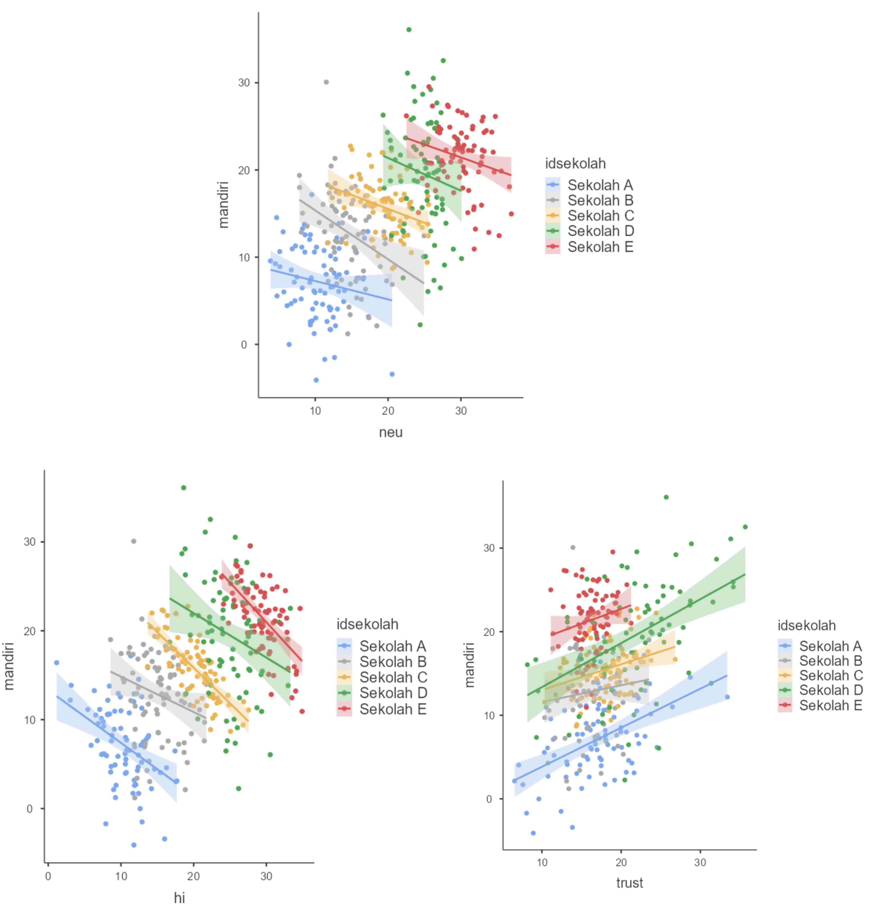

:::

## Ada yang janggal.. 🤔

:::: {.columns}
::: {.column width="55%"}

* _Intercept_ _neuroticism_ dan pendapatan keluarga ternyata **menunjukkan korelasi negatif** dengan tingkat kemandirian, dengan _intercept_ dan kemiringan (_slopes_) yang bervariasi di setiap sekolah.

* Selain itu, meskipun _trust_ menunjukkan korelasi positif di semua sekolah, tetapi _intercept_ dan _slope_ nya juga bervariasi di setiap sekolah

* Padahal, berdasarkan analisis yang kita lakukan di sesi sebelumnya, disimpulkan bahwa **_neuroticism_ ibu dan kemandirian anak korelasinya positif** (lihat _output_ di samping).

* Fenomena ini dikenal sebagai [_Simpson's paradox_](https://en.wikipedia.org/wiki/Simpson%27s_paradox)
  - ..yaitu ketika tren yang diamati di level kelompok berbalik arah atau menghilang sama sekali ketika kelompok-kelompok tersebut digabungkan (diagregasi).

:::
::: {.column width="45%"}

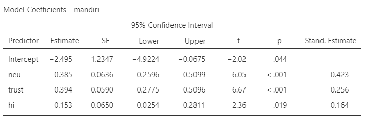

:::
::::

## Ada yang janggal.. 🤔

:::: {.columns}
::: {.column width="55%"}

* Hati-hati _ecological fallacy_!
  - Terjadi ketika kita salah menyimpulkan suatu gejala yang skalanya individual, padahal yang dianalisis oleh peneliti sesungguhnya fenomena di level yang lebih besar (kelompok atau sub-kelompok)
:::
::: {.column width="45%"}

:::
::::

## Struktur sampel bersarang/berjenjang

## Apa yang harus dilakukan?

::: {.incremental}

* Kita abaikan saja dan langsung menggunakan regresi OLS, dengan atau tanpa informasi mengenai pengelompokan data sebagai variabel kontrol.
  - Masalahnya, data/observasi kita sangat bergantung pada pengelompokan unit analisis
  - **Nah, lalu melanggar asumsi OLS?** (data/observasi dan residual harus independen)
  - Efeknya, _standard error_ yang diestimasi oleh model terlalu kecil (karena mengabaikan varians dependen variabel yang ditentukan oleh kelompok)
  - Varians variabel dependen yang tidak bisa dijelaskan (residual) akan makin besar
  - Kesimpulan/inferensi yang ditarik menjadi tidak tepat, sehingga risiko terjadinya _type I error_ meningkat.

:::

## Apa yang harus dilakukan?

::: {.incremental}

* Bagaimana kalau pengelompokan (_group status_) dimasukkan aja dalam regresi OLS sebagai variabel moderator
  - Dengan begitu, estimasi _standard error_ disesuaikan dengan menggunakan _marginal model_
  - Estimasi _standard error_ akan lebih presisi, **tetapi** kita tetap tidak bisa mengestimasi _between-group variance_

* Kalau diagregat? Jadi, unit analisis yang tadinya individual, menjadi kelompok.
  - Ukuran sampel menjadi lebih sedikit, sehingga _statistical power_ menjadi lebih rendah❗

:::

## _Fixed_ dan _random effects_

:::: {.columns}
::: {.column width="50%"}

### Model _fixed effects_

:::
::: {.column width="50%"}

### Model _random effects_

:::
::::

## _Full model_

## Kovarians antara _random intercept_ dan _random slopes_ (σ~U0~~U1~)

* **Nilainya positif**, maka semakin tinggi _intercept_ akan diasosiasikan dengan kemiringan garis yang lebih curam/_slopes_ yang lebih besar

* Misalnya, di sekolah yang **rata-rata pendapatan** keluarga inti perbulan siswanya **tinggi**, maka **korelasi** antara pendapatan per bulan dengan tingkat kemandirian siswa **akan menguat**.

* **Nilainya negatif**, maka semakin tinggi _intercept_ akan diasosiasikan dengan kemiringan garis yang lebih landai/_slopes_ yang lebih kecil

* Misalnya, di sekolah yang **rata-rata pendapatan** keluarga inti perbulan siswanya **tinggi**, maka **korelasi** antara pendapatan per bulan dengan tingkat kemandirian siswa **akan melemah**.

## Parameter yang diestimasi dalam `lme`

* _Fixed intercept_ (_c_~00~)

* _Fixed slopes_ (_c_~10~)

* Varians _random intercept_ (σ^2^~U0~)

* Varians _random slopes_ (σ^2^~U1~)

* Kovarians antara _random intercept_ dan _random slopes_ (σ~U0~~U1~)

* Varians residual level-1 (σ^2^~e~)

# Yuk kita coba! 💪 {background-color="#14497F"}

Pastikan _module_ `GAMLj` sudah terpasang di `jamovi`

## Latihan 3️⃣: Kembali ke dataset sekolah 🏫

Setelah menginspeksi data secara visual, kita tidak bisa mempertahankan kesimpulan bahwa **tingkat pendapatan** dan **tingkat kemandirian anak** berkorelasi positif. Kita akan membuat _linear mixed model_ dengan **tingkat pendapatan** sebagai prediktor, dan **tingkat kemandirian anak** sebagai variabel dependen.

### Buat "model kosong" (_null model_)

* Yaitu model yang isinya hanya _intercept_ saja, tidak ada prediktornya (_slopes_)

* Pada _menu bar_, klik **Linear Models**, pilih **mixed models**
  - Masukkan **mandiri** dalam kolom **dependent variable**
  - Masukkan **idsekolah** dalam kolom **cluster variables**
  - Pada menu **random effects** masukkan **intercept|idsekolah** dalam kolom **random coefficients**

* Pada menu **model comparison** centang **more fit indices**
* Catat nilai AIC yang tersedia dalam tabel **additional indices**

* Di sesi sebelumnya, sudah dijelaskan tentang [fungsi AIC dan BIC](https://rameliaz.github.io/mlm-lme-workshop/materi-lme1.html#/model-fit-1)

## Latihan 3️⃣: Model dengan prediktor

### Bikin _linear mixed model_ dengan prediktor

* Masukkan **hi** dalam kolom **covariates**

* Pada menu **random effects**, masukkan juga **hi|idsekolah**, karena kita akan mengestimasi **random slopes**-nya juga
  - Centang opsi **LRT for Random Test** dan **random coefficients**

* Pada menu **covariates scaling**, ubah **centered** menjadi **centered clusterwise**
  - Berkaitan dengan **partitioning** (akan dijelaskan di bagian selanjutnya)

## _Fixed coefficients_

:::: {.columns}
::: {.column}

* Tes kecocokan model (_Omnibus Test_) signifikan menggambarkan data (_F_(1, 3.28) = 51.7, _p_ = .004)
* Korelasi antara tingkat pendapatan keluarga dengan kemandirian anak negatif, bukan positif, seperti hasil OLS sebelumnya
* Anak yang dibesarkan di keluarga dengan tingkat pendapatan yang tinggi, justru memiliki tingkat kemandirian yang rendah (_B_ = -0.623 95% CI [-0.794, -0.453], _SE_ = 0.086, _t_ = -7.29, _p_ = .004).

:::
::: {.column}

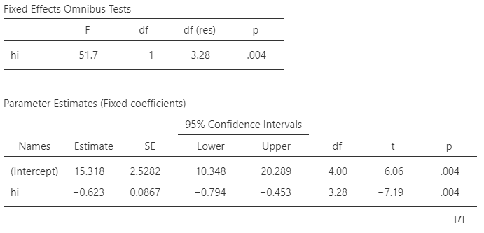

:::
::::

## _Random coefficients_ 1️⃣

:::: {.columns}
::: {.column width="55%"}

* Bandingkan varians _random intercept_ (σ^2^~U0~) dan varians _random slopes_ (σ^2^~U1~) **dengan** varians residual
* Varians _random intercept_ lebih besar, sedangkan varians _random slopes_ lebih kecil
* Artinya, tingkat kemandirian berbeda signifikan antar-sekolah, namun **kekuatan korelasi/hubungan** antara pendapatan rumah tangga dengan tingkat kemandirian relatif tidak berbeda antar sekolah

:::
::: {.column width="45%"}

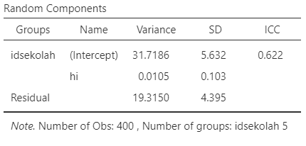

:::
::::

## Interpretasi _random intercept_ dan _random slopes_ (vs. residual)

| Varians _Random Intercept_ | Varians _Random Slope_ | Interpretasi |
|---|---|---|
| Besar | Kecil | Kelompok berbeda secara substansial dalam rata-rata *outcome*, tetapi hubungan antara prediktor dan *outcome* relatif seragam di semua kelompok |
| Kecil | Besar | Kelompok memiliki rata-rata *outcome* yang serupa, tetapi kekuatan (dan/atau arah) hubungan antara prediktor dan *outcome* sangat bervariasi antar kelompok |
| Besar | Besar | Kelompok berbeda baik dalam rata-rata *outcome* maupun dalam hubungan prediktor–*outcome* — periksa kovarians *intercept-slope* (σ~U0~~U1~) untuk melihat apakah kelompok dengan rata-rata tinggi juga memiliki _slope_ yang lebih besar atau lebih kecil |
| Kecil | Kecil | Sedikit variasi antar kelompok — struktur *multilevel* mungkin tidak diperlukan, pertimbangkan model regresi OLS |

## _Random coefficients_ 2️⃣

:::: {.columns}
::: {.column}

* Menguji efek sekolah (kelompok)
  - _Intra-class correlation_, yaitu merupakan proporsi total varians variabel dependen yang dapat dijelaskan oleh variasi antar kelompok

  - _Likelihood ratio test_ (LRT), yaitu teknik untuk menguji ada/tidaknya perbedaan varians antar-kelompok

  - LRT dan ICC juga bisa berfungsi sebagai indikator perlu/tidaknya `lme` dilakukan

:::
::: {.column}

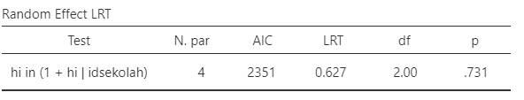

:::
::::

## _Random coefficients_ 3️⃣

:::: {.columns}
::: {.column}

* ICC = 0.622, artinya **62.2%** varians tingkat kemandirian siswa dijelaskan oleh perbedaan sekolah. 

* ICC di atas 0.1 biasanya menunjukkan `lme` adalah opsi yang lebih baik daripada OLS.

* LRT menunjukkan bahwa ada perbedaan yang signifikan antara varians tingkat kemandirian antar-sekolah (LRT(2)=74.0, _p_<.001), tetapi...

* ...struktur multilevel tetap dipertahankan mengingat besarnya ICC yang mengindikasikan ketidakindependenan observasi dalam sekolah yang sama.

* LRT bisa jadi tidak signifikan karena _power_ rendah akibat kita hanya punya sedikit kelompok (< 5 sekolah) dalam dataset

:::
::: {.column}

:::
::::

## _Random coefficients_ 4️⃣

:::: {.columns}
::: {.column}

* Korelasi antara _random slopes_ dan _random intercept_ (σ~U0~~U1~) nilainya negatif.

* Artinya, sekolah yang siswanya rata-rata lebih mandiri, korelasi negatif pendapatan keluarga terhadap kemandirian lebih kuat (pendapatan tinggi, kemandirian justru makin turun drastis)

* Jadi pendapatan keluarga justru lebih "menonjol" sebagai penjelas variasi kemandirian yang tersisa di sekolah dengan rata-rata kemandirian yang tinggi. Efek negatifnya lebih kuat.

* Apakah artinya lingkungan sekolah tidak berdampak pada kemandirian anak?
  - Akan kita eksplorasi di bagian selanjutnya (*contextual effect*)

:::
::: {.column}

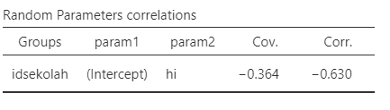

:::
::::

## _Random coefficients_ 5️⃣

:::: {.columns}
::: {.column}

* Tabel di samping adalah _intercept_ dan _slopes_ untuk masing-masing sekolah
* Sekolah E adalah sekolah dengan rata-rata kemandirian yang paling tinggi (_intercept_ paling besar)
* Sekaligus sekolah dengan korelasi antara kemandirian dan tingkat pendapatan keluarga yang paling tinggi (_slope_ paling besar)

:::

::: {.column}

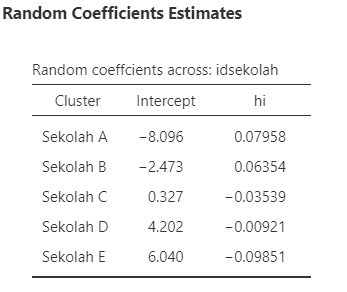

:::
::::

## _Model Comparison_ 1️⃣

:::: {.columns}
::: {.column}

* **AIC**
  - Apabila kita membandingkan "model kosong" (atas) dengan model yang ada prediktor (bawah), maka model yang terakhir lebih mampu menjelaskan varians kemandirian anak.

* LRT _test_ signifikan pada _null model_ (atas) tetapi menjadi nonsignifikan pada model dengan prediktor (bawah)

* Artinya, mempertahankan struktur bersarang memang pilihan tepat dan menguatkan dugaan sebelumnya bahwa LRT _test_ yang tidak signifikan karena _under-powered_

:::
::: {.column}

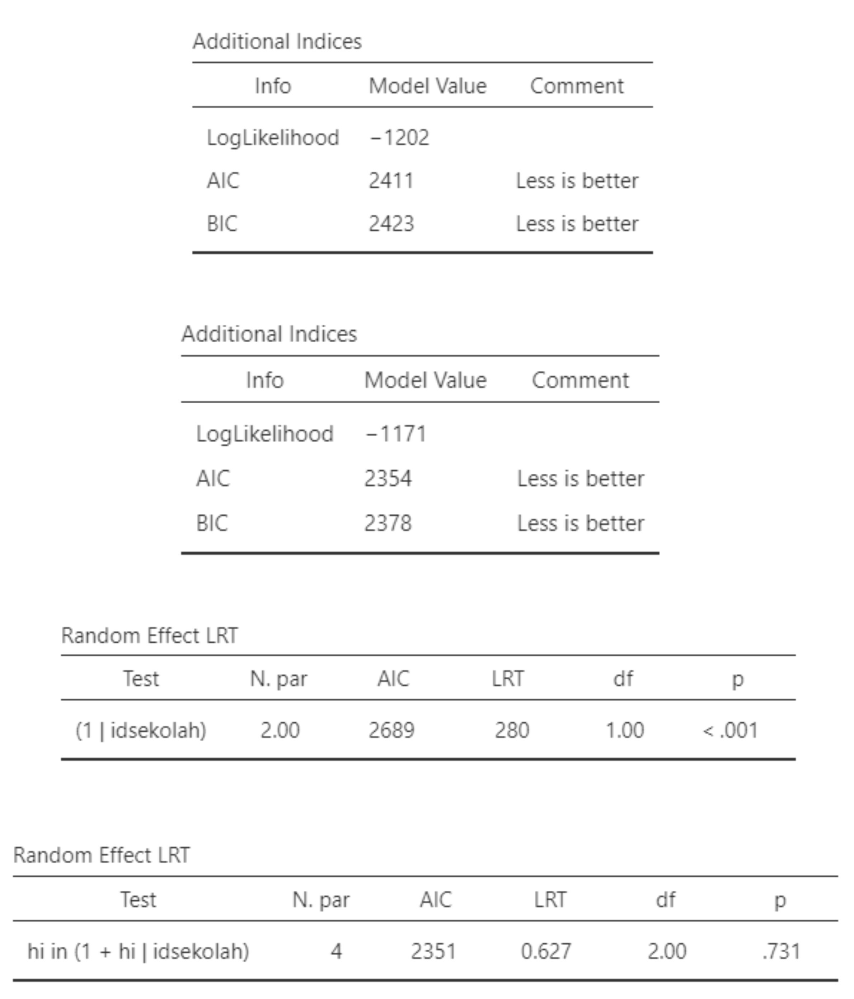

:::
::::

## _Model Comparison_ 2️⃣

:::: {.columns}
::: {.column}

* **R^2^ ([Nakagawa & Schielzeth, 2012](https://besjournals.onlinelibrary.wiley.com/doi/full/10.1111/j.2041-210x.2012.00261.x))**

  - _Marginal_: proporsi varians variabel dependen yang dapat dijelaskan oleh **fixed models** saja

  - _Conditional_: proporsi varians variabel dependen yang dapat dijelaskan oleh **fixed** dan **random models** sekaligus

  - Varians yang dapat dijelaskan oleh _fixed model_ saja hanya **6.4%**, sedangkan oleh keseluruhan model adalah **64.6%**.

:::
::: {.column}

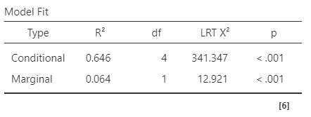

:::
::::

## **_Within-group effect_**

:::: {.columns}
::: {.column}

* Seberapa besar selisih Y dari 2 orang yang berada di **kelompok yang sama**, ketika **selisih X**-nya sebesar 1 poin?
* Seberapa besar perbedaan tingkat kemandirian dua orang anak yang berada dalam **sekolah yang sama**, ketika selisih **tingkat pendapatan keluarga** mereka berbeda sebesar 1 poin?
  - Didapatkan dengan cara melakukan _group-mean centering_ (akan dijelaskan di bagian berikutnya)

:::
::: {.column}

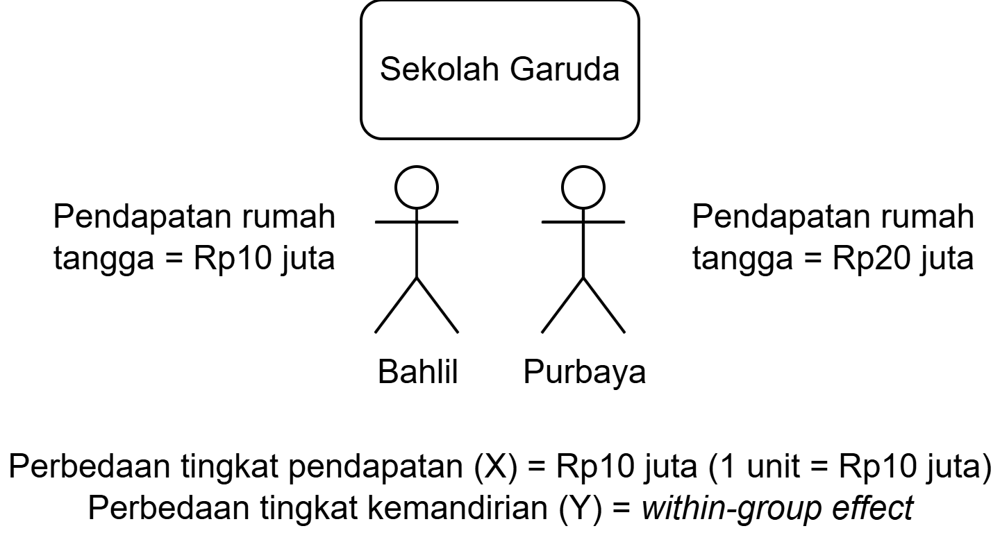

:::
::::

## **_Between-group effect_**

:::: {.columns}
::: {.column}

* Seberapa besar selisih Y dari dua orang yang masing-masing **berada pada rerata X kelompok mereka** (yaitu, X individual = rerata kelompok), ketika **rerata X kelompok** mereka berbeda sebesar 1 poin?
* Seberapa besar perbedaan **tingkat kemandirian** dari dua siswa yang masing-masing berada pada rerata **tingkat pendapatan keluarga** di sekolah mereka (yaitu, tingkat pendapatan keluarga siswa tsb = rerata sekolah), ketika rerata **tingkat pendapatan keluarga** di sekolah mereka berbeda sebesar 1 poin?
  - Didapatkan dengan cara memasukkan rerata kelompok ke dalam model

:::
::: {.column}

:::
::::

## _Contextual effects_

:::: {.columns}
::: {.column}

* Seberapa besar selisih Y dua orang dari kelompok yang berbeda, namun dengan **X yang sama**, ketika **rerata X kelompoknya** berbeda sebesar 1 poin.
* Seberapa besar perbedaan **tingkat kemandirian** dua siswa dari **dua sekolah yang berbeda**, ketika tingkat pendapatan keluarga kedua siswa tersebut sama, tetapi rerata tingkat pendapatan keluarga di sekolah mereka berbeda sebesar 1 poin?

:::
::: {.column}

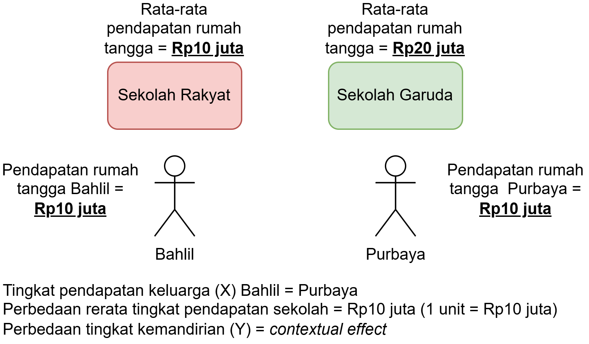

:::
::::

## _Contextual effects_ & _partitioning_ 1️⃣

* Untuk menghitung _contextual effect_, kita harus melakukan _partitioning_ terlebih dahulu

* Umumnya yang dipartisi/_centering_ adalah **variabel X, bukan Y**

* Prosedurnya menggunakan ([Mundlak's _approach_](https://pages.stern.nyu.edu/~wgreene/Econometrics/Mundlak-1978.pdf)):
  - Lakukan _group-mean centering_
  - Hitung rerata tiap kelompok
  - Masukkan keduanya ke dalam model

## _Contextual effects_ & _partitioning_ 2️⃣

* **_Group-mean centering_**
  - Hitung _group-mean centering_ dengan formula $$X_{within_{ij}} = X_{ij} - \bar{X}_{j}$$
  - Sederhananya: nilai X individu dikurangi rata-rata X kelompoknya
  - Pendapatan keluarga anak $i$ dikurangi rata-rata pendapatan keluarga anak-anak di sekolah $j$

* Masukkan skor variabel X yang sudah di _centering_ dan rerata masing-masing kelompok ke dalam model

* **_Contextual effect_** = _Between-group effect_ - _Within-group effect_
  - Positif: ketika **rata-rata X kelompok** lebih **tinggi** sebesar 1 poin, **rata-rata Y kelompok** cenderung lebih **tinggi**, bahkan setelah nilai X individu dikontrol
  - Negatif: kebalikannya — kelompok dengan **rata-rata X lebih tinggi** justru memiliki **rata-rata Y lebih rendah**, setelah X individu dikontrol

## Latihan 4️⃣: _Contextual effects_

:::: {.columns}
::: {.column width="55%"}

* Lakukan `lme` dengan memasukkan **hi_group_centered** dan **hi_gm** dalam satu model yang sama

* Masukkan kedua variabel tersebut dalam **fixed coefficients** 

* Masukkan _intercept_ (Intercept|idsekolah) dan **hi_group_centered** ke kotak **random coefficients**, kemudian pada menu **effect correlation** pilih `not correlated`

* Pada menu **covariates scaling**, set keduanya pada `none`

* Lihat _fixed slopes_-nya untuk kedua prediktor

::: {.callout-warning}
Jangan masukkan **hi_gm** ke _random coefficient_ karena ini adalah rerata kelompok, sehingga nilainya sama untuk semua individu di kelompok yang sama.
:::

:::
::: {.column width="45%"}

{width="100%"}

:::
::::

## _Contextual effects_: Hasil

:::: {.columns}
::: {.column width="55%"}

* _Within_ (_B_ = -0.621 95% CI [-0.786, -0.456], _SE_ = 0.084, _t_ = -7.386, _p_ = .004), maupun _between-group effect_ (_B_ = 0.732 95% CI [0.583, 0.881], _SE_ = 0.075, _t_ = 9.76, _p_ = .002) berhubungan dengan tingkat kemandirian siswa.
* _Within-group effect_: Di dalam sekolah yang sama, siswa dengan tingkat pendapatan keluarga yang lebih tinggi cenderung memiliki tingkat kemandirian yang lebih rendah.
* _Between-group effect_: Ada bukti bahwa sekolah dengan rata-rata pendapatan keluarga yang lebih tinggi cenderung memiliki siswa yang lebih mandiri.

* **_Contextual effects_** ($\beta_{between_{ij}}-\beta_{within_{ij}}$ = 0.732 - (-0.621) = 1.535) menunjukkan bahwa terdapat pengaruh tambahan dari konteks sekolah (yang cukup substansial) terhadap kemandirian siswa, di luar pengaruh pendapatan keluarga siswa itu sendiri. 

:::
::: {.column width="45%"}

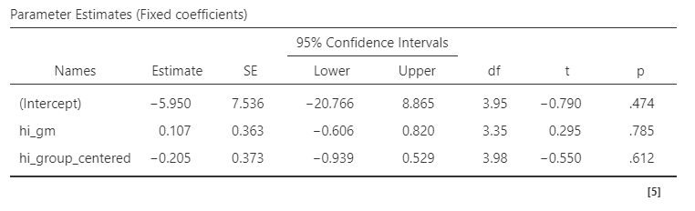

:::
::::

## Bagaimana melaporkannya? 1️⃣

"...untuk menguji hipotesis bahwa ada perbedaan rerata tingkat kemandirian anak, dan korelasi antara pendapatan keluarga dengan tingkat kemandirian anak di masing-masing sekolah, peneliti melakukan analisis _linear mixed effect_.

Tingkat kemandirian anak dijelaskan sebagai fungsi dari tingkat pendapatan keluarga, dengan mengontrol asal sekolah (PAUD) anak. Sebelum melakukan analisis, tingkat pendapatan keluarga dipartisi dengan cara menguranginya dengan rata-rata tingkat pendapatan keluarga di masing-masing sekolah (_group-mean/cluster-based centering_).

Pengujian model menghasilkan kesimpulan bahwa model cocok menggambarkan data (_F_(1, 3) = 93, _p_ = .002), sehingga dapat disimpulkan bahwa tingkat pendapatan keluarga dan kemandirian anak, berkaitan secara berarti.

Model _fixed effects_ menunjukkan bahwa ada bukti bahwa perbedaan tingkat pendapatan keluarga di dalam sekolah yang sama berhubungan dengan perbedaan tingkat kemandirian (_within-group effect_: _B_ = -0.621 95% CI [-0.786, -0.456], _SE_ = 0.084, _t_ = -7.386, _p_ = .004). Artinya, di dalam sekolah yang sama, siswa dengan tingkat pendapatan keluarga yang lebih tinggi cenderung memiliki tingkat kemandirian yang lebih rendah.

Selain itu, ada bukti bahwa sekolah dengan rata-rata tingkat pendapatan keluarga yang lebih tinggi cenderung memiliki rata-rata tingkat kemandirian yang lebih tinggi (_between-group effect_: _B_ = 0.732 95% CI [0.583, 0.881], _SE_ = 0.075, _t_ = 0.084, _p_ = .002)."

## Bagaimana melaporkannya? 2️⃣

"...model _random effects_ menunjukkan bahwa ada perbedaan varians tingkat kemandirian antar-kelompok (LRT(1) = 8.188, _p_ = .004) yang signifikan antar sekolah. 

_Contextual effects_ ditemukan sebesar 1.535, yang menunjukkan bahwa ada pengaruh tambahan dari konteks sekolah yang cukup substansial terhadap tingkat kemandirian siswa, di luar pengaruh pendapatan keluarga siswa itu sendiri."

## Latihan mandiri 2️⃣

* Lakukan analisis `lme` untuk mengetahui:

  - Apakah varians **tingkat kemandirian anak** dapat dijelaskan oleh sekolah tempat anak tersebut belajar?

  - Apakah varians korelasi antara kecenderungan **_neuroticism_** ibu dengan **kemandirian anak** juga dapat dijelaskan oleh sekolah tempat anak tersebut belajar?

  - Seberapa besar perbedaan **tingkat kemandirian** dua orang anak yang berada di **sekolah yang berbeda**, yang **ibunya sama-sama pencemas**, apabila **rata-rata _neuroticism_** wali murid di **dua sekolah tersebut** berbeda sebesar 1 poin?

## Yang belum dibahas...

* Kalau korelasi antara X dan Y tidak linear, pakai apa _dong_?
  - Jelas tidak bisa menggunakan `lme`. Alternatifnya, bisa menggunakan [_generalized additive model_ (GAM)](https://en.wikipedia.org/wiki/Generalized_additive_model).

* Kalau prediktornya level-2, bagaimana?

* Bagaimana cara merencanakan jumlah sampelnya?

* Bagaimana kalau sampelnya bersarang/berjenjang level-3, bahkan lebih?

* Bagaimana kalo terjadi interaksi antara variabel prediktor level-1 dengan level-2 (_cross-level interactions_)?

## _The problem with linear relationship_

{width="40%" fig-align="center"}

## Ada pertanyaan❓

{fig-align="center"}

::: {.callout-note}
* Paparan disusun dengan menggunakan <i class="fa-brands fa-r-project"></i> dan [**Quarto**](https://quarto.org) dengan _template_ dari [UNAIR Theme](https://github.com/rameliaz/quarto-unair-theme).
* Kontak saya via <i class="fa-solid fa-paper-plane"></i> <a href="mailto:amelia.zein@psikologi.unair.ac.id">amelia.zein@psikologi.unair.ac.id</a>
:::
