## _Outline_

* Struktur data berjenjang/bersarang (*hierarchical/nested data*)
* *Within* dan *between group variance*
* Pengantar *linear mixed-effect* (`lme`)
* *Intra-class correlation* dan *likelihood ratio test* (LRT)
* Membandingkan garis regresi antar kelompok dengan `lme`
* `lme` dengan prediktor level 1 (*random coefficients model*)
  - Mengidentifikasi *intercept* (konstanta) yang berbeda antar kelompok (*random intercept model*)
  - Mengidentifikasi *slopes* (gradien/kemiringan garis) yang berbeda antar kelompok (*random slopes model*)
* *Explained variances* ([Nakagawa & Schielzeth, 2012](https://besjournals.onlinelibrary.wiley.com/doi/full/10.1111/j.2041-210x.2012.00261.x))
  - *Marginal R^2^*
  - *Conditional R^2^*
* *Contextual effect* dan *partitioning/centering*
* Melaporkan analisis dengan `lme` dalam manuskrip

## Coba kita lihat lebih dekat...

* Di sesi sebelumnya, kita telah melakukan analisis regresi OLS dengan [**dataset-sekolah.omv**](materials/dataset-sekolah.omv)
  - [Baca ilustrasi kasusnya disini](https://rameliaz.github.io/mlm-lme-workshop/materi-lme1.html#/ilustrasi-kasus)

* Coba kita lakukan inspeksi visual sekali lagi pada dataset yang sama

* Buat *scatterplot* dimana **mandiri** menjadi **Y-Axis**, sedangkan **neu**, **hi**, **trust** sebagai **X-Axis**

* Kemudian masukkan **idsekolah** pada kolom **Group**
  - Fungsinya, kita akan mendapatkan garis regresi untuk masing-masing sekolah

* Apa yang terjadi?

## _Scatterplot_ {.center}

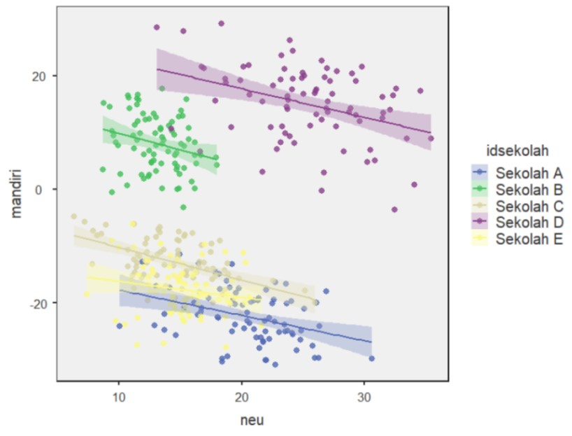 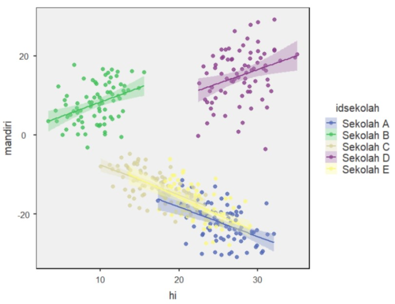

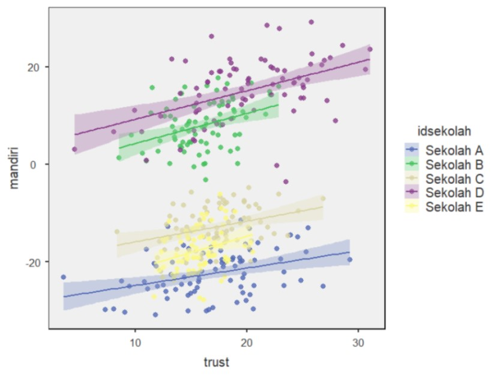

## Ternyata *covariance*-nya berbeda di tiap sekolah! 😱

:::: {.columns}
::: {.column width="55%"}

* *Intercept* *neuroticism* dan *trust* ternyata bervariasi di setiap sekolah

* Yang menarik, tidak hanya *intercept*, *slope* pendapatan personal juga bervariasi di setiap sekolah
  - Berdasarkan analisis yang kita lakukan di sesi sebelumnya, disimpulkan bahwa **pendapatan keluarga dan kemandirian anak korelasinya negatif**
  - Tapi bisakah **kesimpulan yang sama** kita tarik untuk Sekolah B dan D?

* Hati-hati *ecological fallacy*!
  - Terjadi ketika kita salah menyimpulkan suatu gejala yang skalanya individual, padahal yang dianalisis oleh peneliti sesungguhnya fenomena di level yang lebih besar (kelompok atau sub-kelompok)
:::
::: {.column width="45%"}

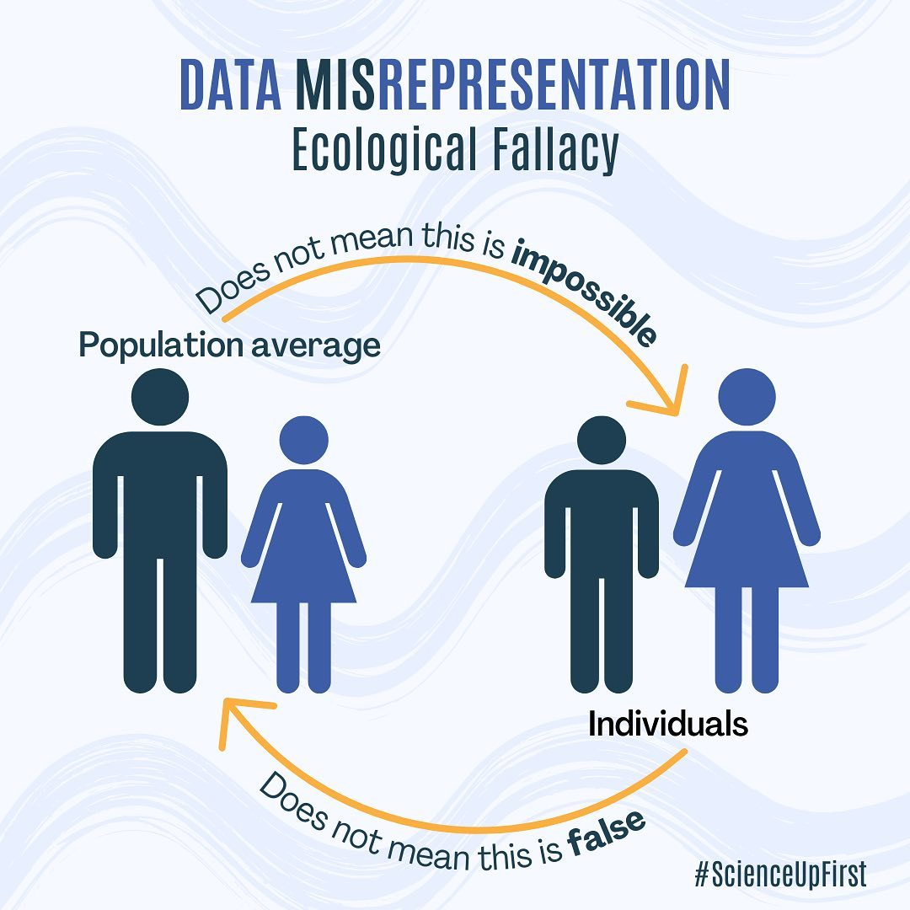

:::
::::

## Struktur sampel bersarang/berjenjang

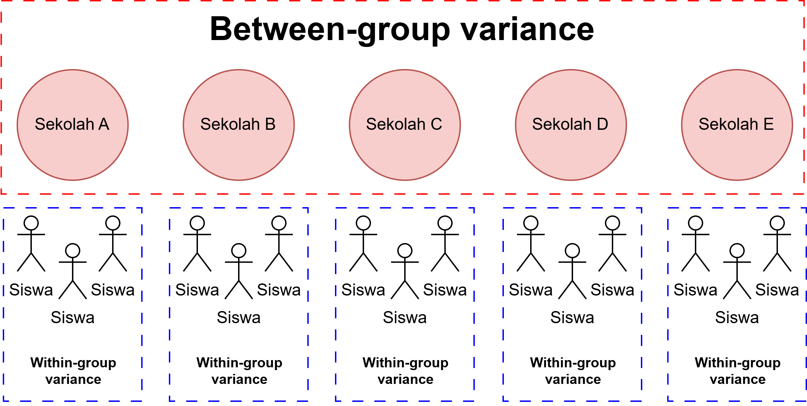

## Apa yang harus dilakukan?

::: {.incremental}

* Kita abaikan saja dan langsung menggunakan regresi OLS, dengan atau tanpa informasi mengenai pengelompokan data sebagai variabel kontrol.
  - Masalahnya, data/observasi kita sangat bergantung pada pengelompokan unit analisis
  - **Nah, lalu melanggar asumsi OLS?** (data/observasi dan residual harus independen)
  - Efeknya, *standard error* yang diestimasi oleh model terlalu kecil (karena mengabaikan varians dependen variabel yang ditentukan oleh kelompok)
  - Varians variabel dependen yang tidak bisa dijelaskan (residual) akan makin besar
  - Kesimpulan/inferensi yang ditarik menjadi tidak tepat, sehingga risiko terjadinya *type I error* meningkat.

* Bagaimana kalau pengelompokan (*group status*) dimasukkan aja dalam regresi OLS sebagai variabel moderator
  - Dengan begitu, estimasi *standard error* disesuaikan dengan menggunakan *marginal model*
  - Estimasi *standard error* akan lebih presisi, **tetapi** kita tetap tidak bisa mengestimasi *between-group variance*

* Kalau diagregat? Jadi, unit analisis yang tadinya individual, menjadi kelompok.
  - Ukuran sampel menjadi lebih sedikit, sehingga *statistical power* menjadi lebih rendah ❗

:::

## *Fixed* dan *random effects*

:::: {.columns}
::: {.column width="50%"}

### Model *fixed effects*

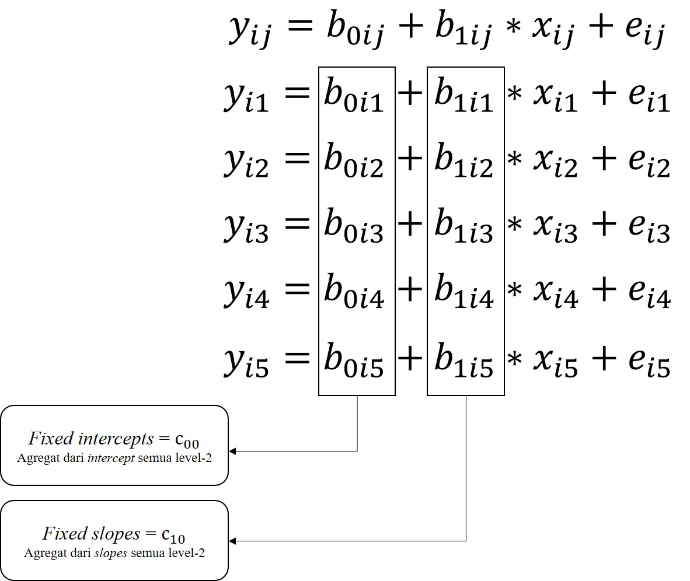

:::
::: {.column width="50%"}

### Model *random effects*

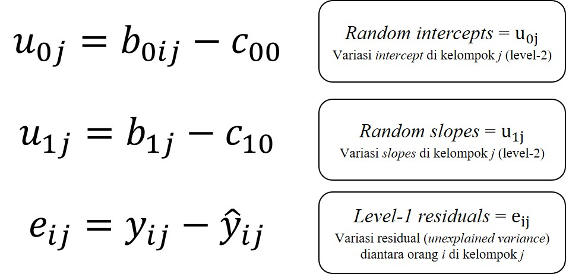

:::
::::

## *Full model* 

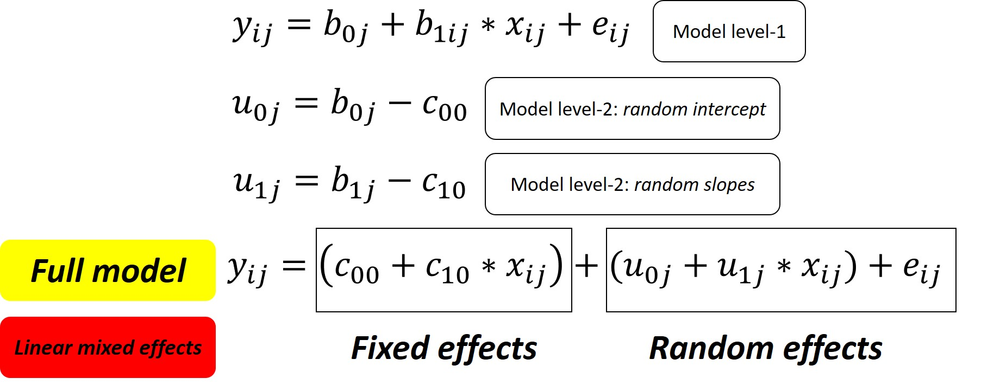

## Kovarians antara *random intercept* dan *random slopes* (σ~U0~~U1~)

* **Nilainya positif**, maka semakin tinggi *intercept* akan diasosiasikan dengan kemiringan garis yang lebih curam/*slopes* yang lebih besar

* Misalnya, di sekolah yang **rata-rata pendapatan** keluarga inti perbulan siswanya **tinggi**, maka **korelasi** antara pendapatan per bulan dengan tingkat kemandirian siswa **akan menguat**.

* **Nilainya negatif**, maka semakin tinggi *intercept* akan diasosiasikan dengan kemiringan garis yang lebih landai/*slopes* yang lebih kecil

* Misalnya, di sekolah yang **rata-rata pendapatan** keluarga inti perbulan siswanya **tinggi**, maka **korelasi** antara pendapatan per bulan dengan tingkat kemandirian siswa **akan melemah**.

## Parameter yang diestimasi dalam *linear mixed effects*

* *Fixed intercept* (*c*~00~)

* *Fixed slopes* (*c*~10~)

* Varians *random intercept* (σ^2^~U0~)

* Varians *random slopes* (σ^2^~U1~)

* Kovarians antara *random intercept* dan *random slopes* (σ~U0~~U1~)

* Varians residual level-1 (σ^2^~e~)

## Yuk kita coba! 💪 {background-color="#14497F"}

Pastikan *module* `GAMLj` sudah terpasang di `jamovi`

## Latihan 3️⃣: Kembali ke dataset sekolah 🏫

Setelah menginspeksi data secara visual, kita tahu bahwa korelasi antara **pendapatan keluarga** dengan **tingkat kemandirian anak** adalah yang paling bervariasi. Kita akan membuat *linear mixed model* dengan **pendapatan keluarga** sebagai prediktor, dan **tingkat kemandirian anak** sebagai variabel dependen.

### Buat "model kosong" (_null model_)

* Yaitu model yang isinya hanya *intercept* saja, tidak ada prediktornya (*slopes*)

* Pada *menu bar*, klik **Linear Models**, pilih **mixed models**
  - Masukkan **mandiri** dalam kolom **dependent variable**
  - Masukkan **idsekolah** dalam kolom **cluster variables**
  - Pada menu **random effects** masukkan **intercept|idsekolah** dalam kolom **random coefficients**

* Catat nilai AIC yang tersedia dalam tabel **model info**

* Di sesi sebelumnya, sudah dijelaskan tentang [fungsi AIC dan BIC](https://rameliaz.github.io/mlm-lme-workshop/materi-lme1.html#/model-fit-1) 

## Latihan (3): Model dengan prediktor

### Bikin *linear mixed model* dengan prediktor

* Masukkan **hi** dalam kolom **covariates**

* Pada menu **random effects**, masukkan juga **hi|idsekolah**, karena kita akan mengestimasi **random slopes**-nya juga
  - Centang opsi **LRT for Random Test**

* Pada menu **covariates scaling**, ubah **centered** menjadi **cluster-based centered**
  - Berkaitan dengan **partitioning** (akan dijelaskan di bagian selanjutnya)

## *Fixed coefficients*

:::: {.columns}
::: {.column width="55%"}

* Tes kecocokan model (*Omnibus Test*) tidak signifikan (*F*(1,3.98)=0.309, p=.608)
  - Berbeda sekali dengan hasil OLS
  - **Kemungkinan besar** korelasi antara pendapatan keluarga per bulan dengan kemandirian **tidak linier**

* Kita tidak punya cukup bukti untuk menolak hipotesis nol, bahwa pendapatan keluarga per bulan dengan kemandirian tidak berkaitan (*B*=-0.207 95% CI [-0.937, 0.523], *SE*=0.372, *t*=-0.556, *p*=.608).
  - Sekali lagi, berbeda sekali dengan hasil OLS

:::
::: {.column width="45%"}

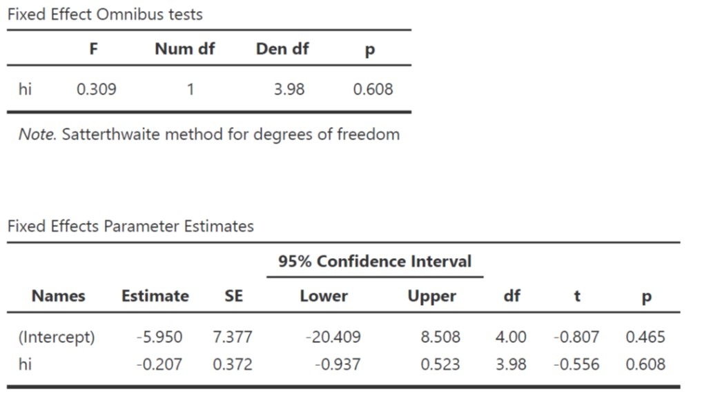

:::
::::

## *Random coefficients* 1️⃣

:::: {.columns}
::: {.column width="55%"}

* Varians kemandirian paling banyak dijelaskan oleh rata-rata tingkat kemandirian siswa (varians *random intercept* (σ^2^~U0~)) daripada oleh varians *random slopes* (σ^2^~U1~).

:::
::: {.column width="45%"}

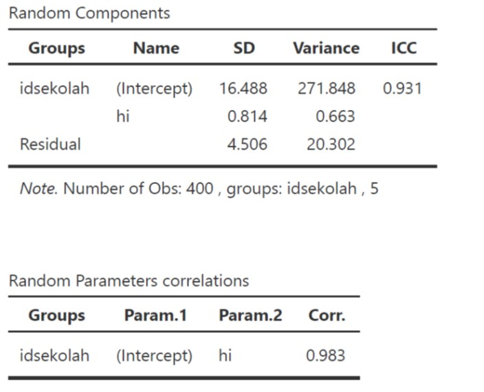

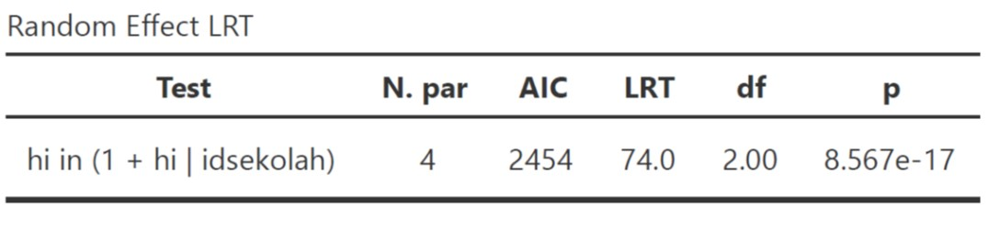

:::
::::

## *Random coefficients* 2️⃣

:::: {.columns}
::: {.column width="55%"}

* Menguji efek sekolah (kelompok)
  - *Intra-class correlation*, yaitu merupakan proporsi total varians variabel dependen yang dapat dijelaskan oleh variasi antar kelompok

  - *Likelihood ratio test* (LRT), yaitu teknik untuk menguji ada/tidaknya perbedaan varians antar-kelompok

  - Keduanya juga bisa berfungsi sebagai indikator perlu/tidaknya `lme` dilakukan

:::
::: {.column width="45%"}

:::
::::

## *Random coefficients* 3️⃣

:::: {.columns}
::: {.column width="55%"}

* ICC=0.931, artinya **93.1%** varians tingkat kemandirian siswa dijelaskan oleh perbedaan sekolah. ICC di atas 0.1 biasanya menunjukkan `lme` adalah opsi yang lebih baik daripada OLS.

* LRT menunjukkan bahwa kita dapat menolak hipotesis bahwa tidak ada perbedaan varians tingkat kemandirian antar-sekolah (LRT(2)=74.0, *p*<.001).

:::
::: {.column width="45%"}

:::
::::

## *Model Comparison*

:::: {.columns}
::: {.column width="55%"}

* **AIC**
  - Apabila kita membandingkan "model kosong" dengan model yang ada prediktor, maka model yang terakhir lebih mampu menjelaskan varians kemandirian anak.

* **R^2^ ([Nakagawa & Schielzeth, 2012](https://besjournals.onlinelibrary.wiley.com/doi/full/10.1111/j.2041-210x.2012.00261.x))**

  - *Marginal*: proporsi varians variabel dependen yang dapat dijelaskan oleh **fixed models** saja

  - *Conditional*: proporsi varians variabel dependen yang dapat dijelaskan oleh **fixed** dan **random models** sekaligus

  - Varians yang dapat dijelaskan oleh *fixed model* saja hanya **0.12%**, sedangkan oleh keseluruhan model adalah **93.18%**.

:::
::: {.column width="45%"}

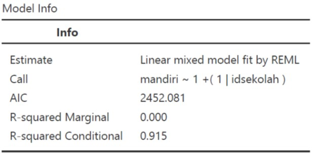

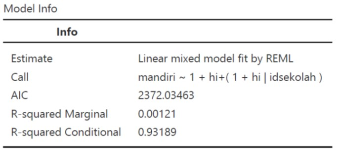

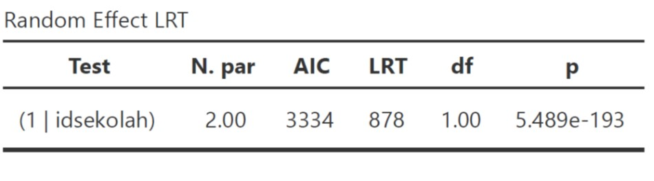

:::
::::

## *Contextual effects* & *partitioning* 1️⃣

* ***Within-group effect***
  - Seberapa besar selisih Y dari 2 orang yang berada di **kelompok yang sama**, ketika **selisih X**-nya sebesar 1 poin?
  - Seberapa besar perbedaan BB dua orang anak yang berada dalam **sekolah yang sama**, ketika selisih **tingkat pendapatan keluarga** mereka berbeda sebesar 1 poin?

* ***Between-group effect***
  - Seberapa besar selisih Y dari 2 orang yang berbeda (dari 2 kelompok yang berbeda), namun berada dalam **posisi relatif yang sama** (dibandingkan dengan rerata kelompok), ketika **selisih X** mereka sebesar 1 poin?
  - Seberapa besar perbedaan **tingkat kemandirian** dua siswa dari **dua sekolah yang berbeda**, ketika posisi **tingkat pendapatan keluarga** mereka relatif sama di sekolah masing-masing, tetapi selisihnya berbeda sebesar 1 poin?

* ***Contextual effect***
  - Seberapa besar selisih Y dua orang dari kelompok yang berbeda, namun dengan **X yang sama**, ketika **rerata X kelompoknya** berbeda sebesar 1 poin.
  - Seberapa besar perbedaan **tingkat kemandirian** dua siswa dari **dua sekolah yang berbeda**, ketika rerata **tingkat pendapatan keluarga** di sekolah mereka berbeda sebesar 1 poin?

## *Contextual effects* & *partitioning* 2️⃣

* Untuk menghitung *contextual effect*, kita harus melakukan *partitioning* terlebih dahulu

* Umumnya yang dipartisi/*centering* adalah **variabel X, bukan Y**

* ***Group-mean centering***
  - Nilai X individu dikurangi rata-rata X kelompoknya
  - Pendapatan keluarga anak A dikurangi rata-rata pendapatan keluarga anak-anak di sekolahnya

* ***Grand-mean centering***
  - Nilai X individu dikurangi rata-rata X pada seluruh sampel
  - Pendapatan keluarga anak A dikurangi rata-rata pendapatan keluarga seluruh anak yang menjadi sampel

* ***Contextual effect*** = *Between-group effect* - *Within-group effect*
  - Positif: **kelompok** dengan **rata-rata X yang lebih tinggi**, cenderung memiliki *intercept* (rata-rata Y) yang **lebih tinggi**
  - Negatif: **kelompok** dengan **rata-rata X yang lebih tinggi**, cenderung memiliki *intercept* (rata-rata Y) yang **lebih rendah**

## Latihan 4️⃣: *Contextual effects*

:::: {.columns}
::: {.column width="55%"}

* Lakukan `lme` dengan memasukkan **hi_group_centered** dan **hi_grand_mean_centered** dalam satu model yang sama

* Masukkan kedua variabel tersebut dalam **fixed coefficients** dan **random coefficients**

* Lihat *fixed slopes*-nya untuk kedua prediktor

:::
::: {.column width="45%"}

{width="100%"}

:::
::::

## *Contextual effects*: Hasil

:::: {.columns}
::: {.column width="55%"}

* Kita tidak punya bukti yang meyakinkan bahwa kita dapat menolak hipotesis bahwa *within* (*B*=0.257 95% CI [-0.115, 0.629], *SE*=0.190, *t*=1.354, *p*=.213), maupun *between-group effect* (*B*=-0.454 95% CI [-1.207, 0.299], *SE*=0.384, *t*=-1.182, *p*=.315) tidak dapat menjelaskan varians tingkat kemandirian anak.

* ***Contextual effects*** = **-0.711**

:::
::: {.column width="45%"}

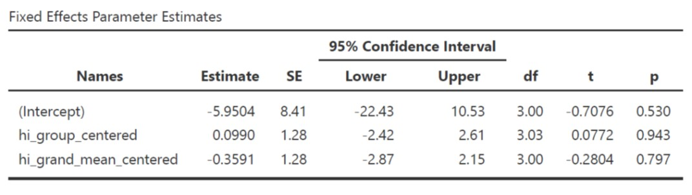

:::
::::

## Bagaimana melaporkannya? 1️⃣

"...untuk menguji hipotesis bahwa ada perbedaan rerata tingkat kemandirian anak, dan korelasi antara pendapatan keluarga dengan tingkat kemandirian anak di masing-masing sekolah, peneliti melakukan analisis *linear mixed effect*.

Tingkat kemandirian anak dijelaskan sebagai fungsi dari tingkat pendapatan keluarga, dengan mengontrol asal sekolah (PAUD) anak. Sebelum melakukan analisis, tingkat pendapatan keluarga dipartisi dengan cara menguranginya dengan rata-rata tingkat pendapatan keluarga di masing-masing sekolah (*group-mean/cluster-based centering*).

Pengujian model menghasilkan kesimpulan bahwa model tidak cocok menggambarkan data (*F*(1,3.98)=0.309, p=.608), sehingga kami gagal menolak hipotesis bahwa tingkat pendapatan keluarga dan kemandirian anak, tidak berkorelasi.

Model *fixed effects* menunjukkan bahwa peneliti tidak punya cukup bukti untuk menolak hipotesis nol, bahwa pendapatan keluarga per bulan dengan kemandirian tidak berkaitan (*B*=-0.207 95% CI [-0.937, 0.523], *SE*=0.372, *t*=-0.556, *p*=.608)."

## Bagaimana melaporkannya? 2️⃣

"...model *random effects* menunjukkan bahwa peneliti dapat menolak hipotesis bahwa tidak ada perbedaan varians tingkat kemandirian antar-kelompok (LRT(2)=74.0, *p*<.001). Varians kemandirian anak paling banyak dijelaskan oleh rata-rata tingkat kemandirian anak di masing-masing sekolah (varians *random intercept* (σ^2^~U0~)) daripada oleh varians *random slopes* (σ^2^~U1~). Selain itu, 93.1% varians tingkat kemandirian anak dijelaskan oleh perbedaan kelompok (ICC=0.931).

Peneliti tidak memiliki cukup bukti yang meyakinkan untuk menolak hipotesis yang menyatakan bahwa *within* (*B*=0.257 95% CI [-0.115, 0.629], *SE*=0.190, *t*=1.354, *p*=.213), maupun *between-group effect* (*B*=-0.454 95% CI [-1.207, 0.299], *SE*=0.384, *t*=-1.182, *p*=.315) tidak dapat menjelaskan varians tingkat kemandirian anak.

*Contextual effects* ditemukan sebesar -0.711, artinya, anak yang bersekolah di dua tempat yang berbeda, dengan selisih rata-rata tingkat kemandirian anak-anak di dua sekolah tersebut sebesar 1 poin, maka tingkat kemandirian mereka berbeda sebesar -0.711 poin, apabila diasumsikan keluarga mereka memiliki pendapatan yang sama besarnya. Tanda negatif mengindikasikan bahwa sekolah yang rata-rata pendapatan keluarga siswanya lebih tinggi, cenderung memiliki rata-rata tingkat kemandirian yang rendah..."

## Latihan mandiri 2️⃣

* Lakukan analisis `lme` untuk mengetahui:

  - Apakah varians **tingkat kemandirian anak** dapat dijelaskan oleh sekolah tempat anak tersebut belajar?

  - Apakah varians korelasi antara kecenderungan **neuroticism** ibu dengan **kemandirian anak** juga dapat dijelaskan oleh sekolah tempat anak tersebut belajar?

  - Seberapa besar perbedaan **tingkat kemandirian** dua orang anak yang berada di **sekolah yang berbeda**, yang **ibunya sama-sama pencemas**, apabila **rata-rata kecemasan** wali murid di **dua sekolah tersebut** berbeda sebesar 1 poin?

## Yang belum dibahas...

* Kalau korelasi antara X dan Y tidak linier, pakai apa _dong_?
  - Jelas tidak bisa menggunakan `lme`. Alternatifnya, bisa menggunakan [*generalized additive model* (GAM)](https://en.wikipedia.org/wiki/Generalized_additive_model).

* Kalau prediktornya level-2, bagaimana?

* Bagaimana cara merencanakan jumlah sampelnya?

* Bagaimana kalau sampelnya bersarang/berjenjang level-3, bahkan lebih?

* Bagaimana kalo terjadi interaksi antara variabel prediktor level-1 dengan level-2 (*cross-level interactions*)?

## *The problem with linear relationship*

{width="40%"}

## Ada pertanyaan❓

{fig-align="center"}

::: {.callout-note}
* Paparan disusun dengan menggunakan <i class="fa-brands fa-r-project"></i> dan [**Quarto**](https://quarto.org) dengan *template* dari [UNAIR Theme](https://github.com/rameliaz/quarto-unair-theme).
* Kontak saya via <i class="fas fa-paper-plane"></i> <a href="mailto:amelia.zein@psikologi.unair.ac.id">amelia.zein@psikologi.unair.ac.id</a>
:::